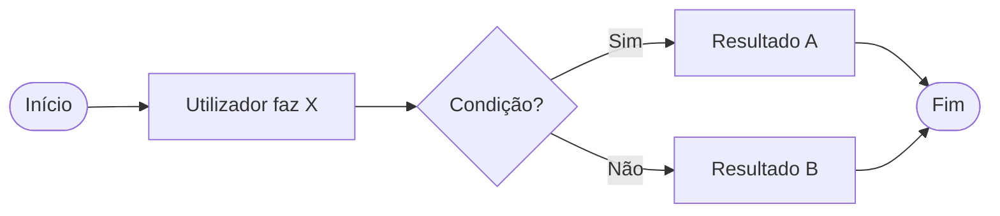

# PRD — Product Requirements Document
## {{NOME DA FUNCIONALIDADE / ÉPICO}}

| Campo | Valor |
|---|---|
| ID | PRD-{{001}} |
| Autor | {{Nome}} |
| Data | {{AAAA-MM-DD}} |
| Estado | Rascunho / Em revisão / Aprovado / Implementado |
| Épico / Iniciativa | {{...}} |
| Equipas envolvidas | {{Backend, Frontend, Design, Data}} |
| Data-alvo | {{...}} |

---

## 1. Resumo executivo (TL;DR)
{{3-5 linhas: o que vamos construir, para quem, e porquê agora.}}

## 2. Contexto e problema
{{Porque é que isto existe. Ligar à [Visão de Produto](01-visao-produto.md).}}

**Porquê agora?** {{Janela de mercado, obrigação legal, dívida técnica a estrangular, pedido de cliente grande...}}

## 3. Objetivos

### 3.1 Objetivos
- {{...}}

### 3.2 Não-objetivos
- {{...}}

### 3.3 Métricas
| Métrica | Tipo | Baseline | Meta | Como medimos |
|---|---|---|---|---|
| {{Taxa de conclusão do fluxo}} | Sucesso | {{62%}} | {{85%}} | {{Evento `checkout_completed` / `checkout_started`}} |
| {{Latência p95}} | Guardrail | {{800ms}} | {{≤ 1s}} | {{APM}} |

## 4. Personas afetadas
{{Ligar a [Personas](02-personas.md)}}

## 5. Requisitos

> Formato: `RF-nn` funcional, `RNF-nn` não funcional. Prioridade MoSCoW.

### 5.1 Funcionais
| ID | Requisito | Prioridade | Critério de aceitação |
|---|---|---|---|
| RF-01 | O sistema deve {{...}} | Must | {{Dado... Quando... Então...}} |
| RF-02 | | Should | |

### 5.2 Não funcionais
| ID | Categoria | Requisito | Como se verifica |
|---|---|---|---|
| RNF-01 | Desempenho | {{p95 < 300 ms com 500 utilizadores concorrentes}} | Teste de carga |
| RNF-02 | Acessibilidade | WCAG 2.2 AA | Auditoria axe + teste manual |

> Detalhe completo em [Requisitos Funcionais](../01-requisitos/02-requisitos-funcionais.md) e [Não Funcionais](../01-requisitos/03-requisitos-nao-funcionais.md).

## 6. Experiência de utilizador

### 6.1 Fluxo principal

### 6.2 Protótipos
- Figma: {{link}}
- Estados a cobrir: vazio · a carregar · com dados · erro · sem permissões · offline

### 6.3 Microcopy e mensagens de erro
| Situação | Mensagem |
|---|---|
| {{Campo obrigatório vazio}} | {{"Indica o teu e-mail."}} |

## 7. Casos de uso e regras de negócio
- Casos de uso: [UC-01, UC-02](../02-analise/01-use-cases.md)
- Regras: [RN-01…](../02-analise/05-regras-negocio.md)

## 8. Considerações técnicas
{{Notas de alto nível. O desenho detalhado vive em [Arquitetura](../03-arquitetura/01-documento-arquitetura.md) e nos ADRs.}}

- Impacto no modelo de dados: {{...}}
- Novas dependências externas: {{...}}
- Migração de dados necessária: Sim/Não — {{...}}
- Feature flag: `{{nome_da_flag}}`

## 9. Analítica e instrumentação
| Evento | Quando dispara | Propriedades |
|---|---|---|
| `{{feature_opened}}` | {{...}} | `user_role`, `source` |

## 10. Plano de lançamento
| Fase | Público | Critério de avanço | Data |
|---|---|---|---|
| Interno (dogfood) | Equipa | Sem bugs críticos 3 dias | {{...}} |
| Beta | {{5% dos utilizadores}} | {{Métrica X ≥ Y}} | {{...}} |
| GA | 100% | | {{...}} |

**Plano de rollback:** {{desligar feature flag; sem migração destrutiva}}

## 11. Questões em aberto
| # | Questão | Responsável | Prazo | Resposta |
|---|---|---|---|---|
| Q1 | {{...}} | {{Nome}} | {{data}} | |

## 12. Alternativas consideradas e rejeitadas
| Alternativa | Porque foi rejeitada |
|---|---|
| {{...}} | {{...}} |
