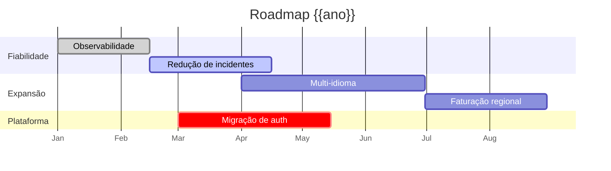

# Roadmap — {{PRODUTO}}

> **Aviso:** o roadmap comunica *intenção e prioridade*, não compromissos de data. Usa "Agora / A seguir / Mais tarde" salvo quando houver obrigação contratual ou legal.

**Última atualização:** {{AAAA-MM-DD}}

---

## Temas estratégicos {{ano}}
| Tema | Objetivo de negócio | Peso |
|---|---|---|
| T1 — {{Fiabilidade}} | {{Reduzir churn causado por incidentes}} | 30% |
| T2 — {{Expansão}} | {{Entrar no mercado X}} | 40% |
| T3 — {{Dívida técnica}} | {{Sustentar velocidade}} | 30% |

## Vista Agora / A seguir / Mais tarde

### Agora (em execução)
| Item | Tema | Problema que resolve | Estado | PRD |
|---|---|---|---|---|
| {{...}} | T1 | {{...}} | Em dev | [PRD-001](03-prd.md) |

### A seguir (próximo ciclo, comprometido)
| Item | Tema | Problema que resolve | Pré-requisitos |
|---|---|---|---|
| {{...}} | T2 | {{...}} | {{...}} |

### Mais tarde (em consideração, não comprometido)
| Item | Tema | Porque nos interessa | O que falta saber |
|---|---|---|---|
| {{...}} | T3 | {{...}} | {{...}} |

### Não vamos fazer (e porquê)
| Item | Razão |
|---|---|
| {{...}} | {{...}} |

## Cronograma indicativo

## Marcos com data fixa
| Marco | Data | Porque é fixa | Risco |
|---|---|---|---|
| {{Conformidade RGPD-X}} | {{data}} | Obrigação legal | {{...}} |

## Registo de alterações ao roadmap
| Data | Alteração | Motivo |
|---|---|---|
| {{data}} | {{Item X movido de Agora para Mais tarde}} | {{...}} |
