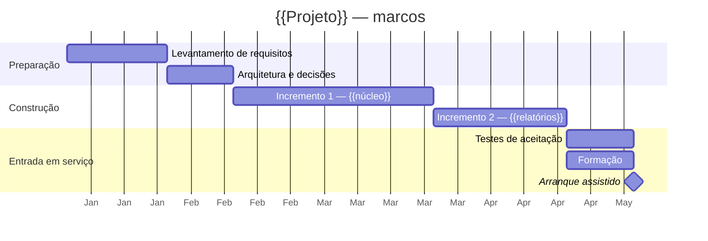
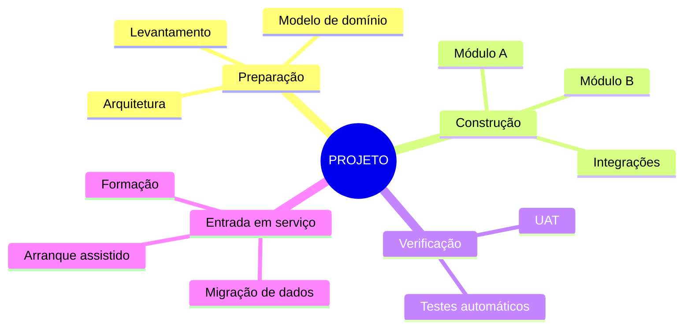

# Plano de Projeto — {{PROJETO}}

> **Estado:** {{rascunho | aprovado | em execução | encerrado}}
> **Versão:** {{1.0}} · **Data:** {{AAAA-MM-DD}} · **Dono:** {{nome}}
> **Aprova:** {{nome/comité}} · **Próxima revisão:** {{AAAA-MM-DD}}

---

## 1. Porque existe este projeto

{{Dois parágrafos, não mais. O problema de negócio, não a solução técnica.
Se não conseguires explicar porque é que isto é feito sem nomear tecnologia,
o projeto ainda não está definido.}}

**Resultado esperado:** {{a mudança concreta no negócio quando isto acabar}}

**Como se saberá que correu bem:**

| # | Indicador | Hoje | Meta | Medido por |
|---|---|---|---|---|
| 1 | {{Tempo médio de registo de uma ocorrência}} | {{12 min}} | {{3 min}} | {{relatório mensal}} |
| 2 | {{...}} | | | |

---

## 2. Âmbito

### 2.1 Dentro do âmbito

| # | Entrega | Descrição | Aceite por |
|---|---|---|---|
| E1 | {{Aplicação web de gestão}} | {{...}} | {{PO}} |
| E2 | {{...}} | | |

### 2.2 Fora do âmbito — e dito por escrito

| Não se faz | Porquê | Quando se reavalia |
|---|---|---|
| {{Integração com o ERP}} | {{Depende de contrato ainda por assinar}} | {{Fase 2}} |
| {{...}} | | |

> Esta tabela é a mais importante do documento. O âmbito não cresce por
> decisão — cresce por omissão, uma conversa de cada vez. O que não está
> escrito aqui como excluído será assumido como incluído por alguém.

### 2.3 Pressupostos e dependências

| # | Tipo | Descrição | Se falhar |
|---|---|---|---|
| P1 | Pressuposto | {{Os dados-mestre existem e estão limpos}} | {{+3 semanas de limpeza}} |
| D1 | Dependência | {{Acesso à base de dados até {{data}}}} | {{Bloqueia E2}} |

---

## 3. Marcos e calendário

| Marco | Data alvo | Critério de conclusão — verificável | Quem confirma |
|---|---|---|---|
| M1 — Requisitos fechados | {{data}} | {{Lista RF assinada; matriz de rastreabilidade preenchida}} | {{PO}} |
| M2 — Arquitetura decidida | {{data}} | {{ADRs escritos para as 3 decisões estruturais}} | {{Arquiteto}} |
| M3 — Incremento 1 aceite | {{data}} | {{UAT passou; 0 defeitos de gravidade 1}} | {{PO}} |
| M4 — Entrada em serviço | {{data}} | {{Runbook entregue; equipa formada; monitorização ativa}} | {{Operação}} |

**Um marco só existe se tiver um critério que alguém possa verificar sem
perguntar a ninguém.** "Desenvolvimento concluído" não é um marco.

---

## 4. Decomposição do trabalho (WBS)

> No Mermaid, `{{ }}` é a sintaxe de uma forma — por isso os marcadores não se
> usam dentro de um `mindmap`. Substituir os nomes diretamente.

| ID | Pacote de trabalho | Entrega | Esforço | Dono | Depende de |
|---|---|---|---|---|---|
| 1.1 | {{Levantamento}} | {{Documento de requisitos}} | {{15 d}} | {{...}} | — |
| 2.1 | {{Módulo A}} | {{Funcionalidade X operacional}} | {{30 d}} | {{...}} | 1.1 |

Detalhe das estimativas em [Estimativas e Esforço](02-estimativas-e-esforco.md).

---

## 5. Equipa e alocação

| Papel | Pessoa | Alocação | Período | Substituto |
|---|---|---|---|---|
| {{Product Owner}} | {{...}} | {{20%}} | {{todo o projeto}} | {{...}} |
| {{Programador}} | {{...}} | {{100%}} | {{...}} | — |

**Fator autocarro:** {{quantas pessoas têm de desaparecer para o projeto parar}}.
Se for 1, isso é um risco no registo, não um facto da vida.

---

## 6. Orçamento

| Rubrica | Estimado | Comprometido | Gasto | Notas |
|---|---|---|---|---|
| Esforço interno | {{X d/h}} | | | |
| Licenças e subscrições | {{€}} | | | {{listar cada uma}} |
| Infraestrutura | {{€/mês}} | | | |
| Formação | {{€}} | | | |
| **Reserva de contingência** | {{10–15%}} | | | Para riscos identificados |

---

## 7. Riscos principais

Os cinco maiores. O registo completo está na
[Matriz de Riscos](../07-governanca/03-matriz-riscos.md).

| # | Risco | P×I | Mitigação | Dono |
|---|---|---|---|---|
| R1 | {{...}} | {{Alto}} | {{...}} | {{...}} |

---

## 8. Como se governa

| Ritual | Quando | Quem | Produz |
|---|---|---|---|
| Ponto de situação | {{semanal, 30 min}} | {{equipa}} | {{Relatório de estado}} |
| Comité de acompanhamento | {{mensal}} | {{patrocinador, PO}} | {{decisões registadas em ata}} |
| Revisão de incremento | {{fim de cada incremento}} | {{equipa + PO}} | {{aceitação ou lista de correções}} |

Papéis e responsabilidades em [Matriz RACI](03-matriz-raci-e-comunicacao.md).
Alterações ao âmbito em [Gestão de Alterações](04-gestao-alteracoes.md).

---

## 9. Critérios de encerramento

O projeto está concluído quando **todos** se verificarem:

- [ ] Todas as entregas da secção 2.1 aceites formalmente
- [ ] Indicadores da secção 1 medidos pelo menos uma vez em produção
- [ ] Documentação operacional entregue e testada por quem vai manter
- [ ] Equipa de manutenção formada e a responder sozinha há {{2 semanas}}
- [ ] [Relatório de Encerramento](../09-encerramento/01-relatorio-encerramento.md) escrito

---

## 10. Histórico de aprovação

| Versão | Data | Alteração | Aprovado por |
|---|---|---|---|
| 1.0 | {{data}} | Versão inicial | {{...}} |
