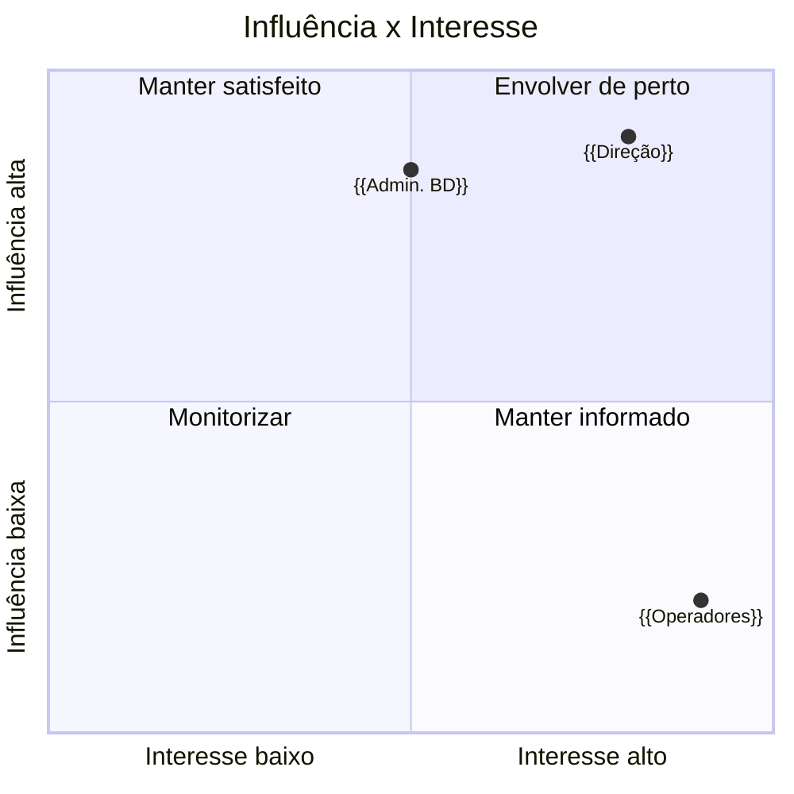

# Responsabilidades e Comunicação — {{PROJETO}}

> **Data:** {{AAAA-MM-DD}} · **Dono:** {{nome}}

---

## 1. Partes interessadas

| # | Pessoa / grupo | Papel no projeto | Interesse | Influência | Como se gere |
|---|---|---|---|---|---|
| 1 | {{Direção}} | Patrocinador | Alto | Alta | Envolver de perto |
| 2 | {{Operadores de armazém}} | Utilizador final | Alto | Baixa | Manter informado e ouvir |
| 3 | {{Admin. de base de dados}} | Fornecedor de serviço | Médio | Alta | Consultar antes de decidir |
| 4 | {{...}} | | | | |

---

## 2. Matriz RACI

**R** — executa · **A** — responde pelo resultado (só uma pessoa) ·
**C** — consultado antes · **I** — informado depois

| Atividade / entrega | {{PO}} | {{Tech Lead}} | {{Programador}} | {{QA}} | {{Admin. BD}} | {{Patrocinador}} |
|---|:--:|:--:|:--:|:--:|:--:|:--:|
| Definir âmbito | A | C | I | I | I | C |
| Priorizar requisitos | A | C | I | C | I | I |
| Decisões de arquitetura | C | A | C | I | C | I |
| Estrutura da base de dados | I | R | R | I | **A** | I |
| Escrever código | I | C | R/A | I | I | I |
| Aceitar entregas | A | C | I | R | I | I |
| Entrada em serviço | C | R | R | C | C | A |
| Alterações ao âmbito | R | C | I | I | I | A |

### Regras de leitura

| Regra | Porquê |
|---|---|
| **Um e só um `A` por linha** | Duas pessoas a responder pelo mesmo resultado é ninguém a responder |
| Se uma linha tem só `I`, falta trabalho | Alguém tem de a executar |
| Se uma coluna só tem `I`, essa pessoa não é parte interessada | É audiência de newsletter |
| `C` obriga a esperar pela resposta | Consultar depois de decidir chama-se informar |

---

## 3. Plano de comunicação

| O quê | Para quem | Quando | Como | Quem envia |
|---|---|---|---|---|
| Relatório de estado | {{Patrocinador, PO}} | {{Sexta, semanal}} | {{E-mail, 1 página}} | {{Gestor}} |
| Ponto de situação | {{Equipa}} | {{Segunda, 15 min}} | {{Presencial/Teams}} | {{Tech Lead}} |
| Demonstração de incremento | {{PO + utilizadores}} | {{Fim de cada incremento}} | {{Sessão de 45 min}} | {{Equipa}} |
| Aviso de risco crítico | {{Patrocinador}} | {{Imediato}} | {{Telefone + e-mail}} | {{Gestor}} |
| Nota de entrada em serviço | {{Todos os utilizadores}} | {{−7 dias e −1 dia}} | {{E-mail + cartaz}} | {{PO}} |

**Regra de escalada:** um bloqueio que não se resolva em {{2 dias úteis}} sobe
para {{papel}}; em {{5 dias}}, para o patrocinador.

---

## 4. Canais e onde vive cada coisa

| Assunto | Canal | Não usar para |
|---|---|---|
| Decisões | {{Ata de reunião + ADR}} | {{Chat — perde-se}} |
| Trabalho diário | {{Quadro de tarefas}} | {{E-mail}} |
| Dúvidas rápidas | {{Chat}} | {{Decisões}} |
| Documentação | {{Repositório, junto do código}} | {{Anexos de e-mail}} |

> Uma decisão tomada no chat e não registada em ata não existe: dentro de três
> meses ninguém a encontra, e ninguém se lembra de quem a tomou nem porquê.
