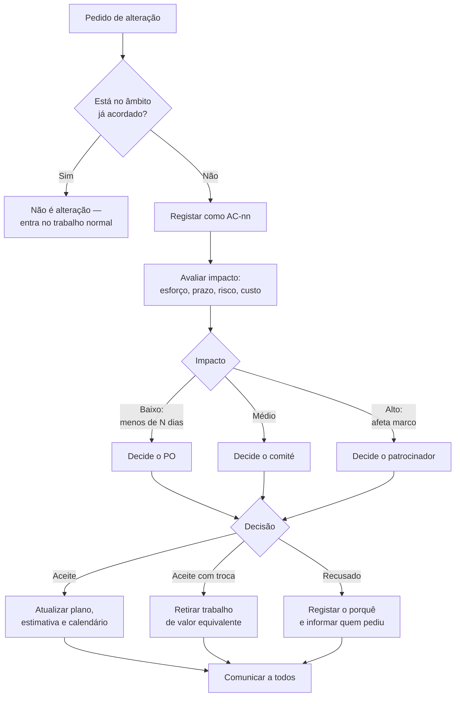

# Gestão de Alterações ao Âmbito — {{PROJETO}}

> **Data:** {{AAAA-MM-DD}} · **Dono:** {{nome}}

---

## 1. Para que serve isto

O âmbito de um projeto raramente cresce por decisão. Cresce por acumulação de
pedidos pequenos, cada um razoável em si mesmo, nenhum grande o suficiente para
justificar uma conversa. Este processo existe para tornar visível o custo
acumulado — não para dificultar alterações.

**Princípio:** qualquer pessoa pode pedir uma alteração; ninguém a aceita sozinho.

---

## 2. Fluxo



---

## 3. Ficha de pedido de alteração

```markdown
### AC-{{nn}} — {{Título curto}}

**Pedido por:** {{nome}}  ·  **Data:** {{AAAA-MM-DD}}
**Estado:** {{registado | em avaliação | aceite | aceite com troca | recusado}}

**O que se pede**
{{Descrição em linguagem de negócio, sem solução técnica.}}

**Porque se pede agora**
{{O que mudou desde que o âmbito foi fechado. Se nada mudou, é um pedido
que já existia e foi deixado de fora — dizê-lo abertamente.}}

**O que acontece se não se fizer**
{{Consequência concreta. "Seria bom ter" é uma resposta válida e
significa que isto vai para a lista de melhorias, não para o projeto.}}

**Impacto avaliado**
| Dimensão | Efeito |
|---|---|
| Esforço | {{+X dias}} |
| Prazo | {{marco M3 desloca-se N dias / sem efeito}} |
| Custo | {{€}} |
| Risco | {{novo risco introduzido, se houver}} |
| Documentos a atualizar | {{lista}} |

**Alternativas consideradas**
{{Incluindo "fazer uma versão mais simples" e "adiar para a fase 2".}}

**Troca proposta** (se o prazo é fixo)
{{O que sai do âmbito para isto entrar. Sem esta linha, o prazo escorrega
e ninguém decidiu que escorregasse.}}

**Decisão:** {{...}}  ·  **Por:** {{...}}  ·  **Data:** {{...}}
**Fundamento:** {{...}}
```

---

## 4. Registo de alterações

| # | Título | Pedido por | Data | Esforço | Decisão | Efeito no prazo |
|---|---|---|---|---|---|---|
| AC-01 | {{...}} | {{...}} | {{...}} | {{+5 d}} | Aceite com troca | Nenhum |
| AC-02 | {{...}} | {{...}} | {{...}} | {{+12 d}} | Recusado | — |

**Acumulado aceite:** {{X dias}} · **Deslocamento total do prazo:** {{Y dias}}

Esta última linha é a razão de ser do documento. Doze pedidos de dois dias são
quase um mês, e nenhum deles pareceu importante no momento em que foi aceite.

---

## 5. Limiares de decisão

| Impacto no esforço | Decide | Prazo de resposta |
|---|---|---|
| ≤ {{2}} dias | {{PO}} | {{2 dias úteis}} |
| {{3–10}} dias | {{Comité de acompanhamento}} | {{Próxima reunião}} |
| > {{10}} dias ou afeta um marco | {{Patrocinador}} | {{5 dias úteis}} |

**Congelamento de âmbito:** a partir de {{marco/data}}, só se aceitam alterações
de gravidade {{crítica}} — as restantes vão para a fase seguinte, sem discussão
caso a caso.
