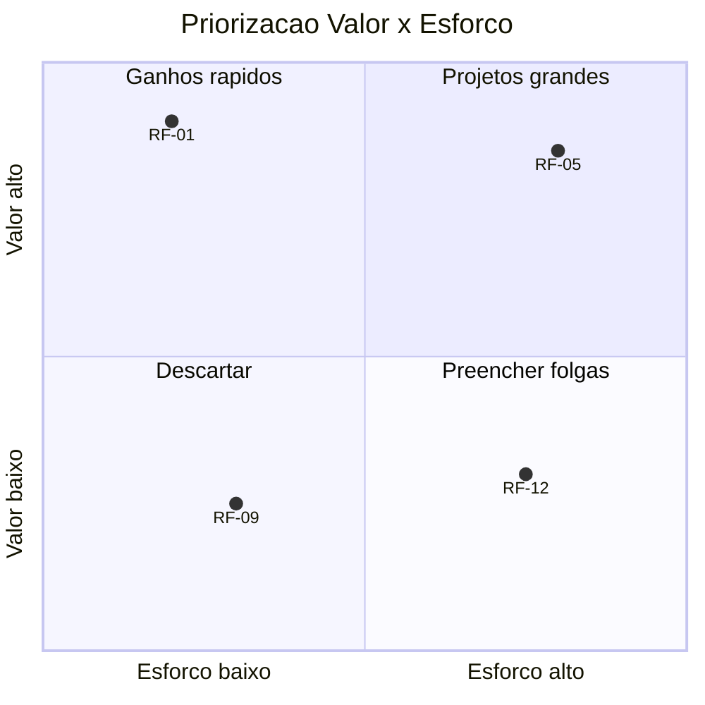

# Levantamento de Requisitos — Guia e Registo
## {{PROJETO}}

| Campo | Valor |
|---|---|
| Analista responsável | {{Nome}} |
| Período de levantamento | {{data início}} – {{data fim}} |
| Estado | Em curso / Concluído |

---

## 1. Planeamento do levantamento

### 1.1 Fontes de requisitos
| Fonte | Tipo | Contacto | Estado |
|---|---|---|---|
| {{Diretor de Operações}} | Entrevista | {{nome}} | Feita {{data}} |
| {{Sistema legado}} | Análise documental | — | Em curso |
| {{Legislação X}} | Regulamentar | — | Pendente |
| {{Tickets de suporte}} | Dados | — | Feita |

### 1.2 Técnicas a aplicar
- [ ] **Entrevistas** individuais com stakeholders
- [ ] **Workshops** / JAD sessions
- [ ] **Observação direta** (shadowing) do trabalho atual
- [ ] **Análise de documentos** e do sistema atual (as-is)
- [ ] **Inquéritos** para amostras grandes
- [ ] **Prototipagem** para validar entendimento
- [ ] **Análise de dados** (logs, tickets, analytics)
- [ ] **Benchmarking** de concorrentes

---

## 2. Guião de entrevista (reutilizável)

**Antes:** enviar agenda, pedir 45-60 min, gravar com consentimento.

### Aquecimento
1. Descreve-me o teu papel e um dia típico.
2. Onde é que este processo entra no teu trabalho?

### Processo atual (as-is)
3. Mostra-me como fazes {{tarefa}} hoje, passo a passo.
4. Com que frequência? Quanto tempo demora?
5. O que corre mal com mais frequência?
6. O que fazes quando o sistema não te deixa fazer algo? *(procurar workarounds)*
7. Que informação precisas ter à mão e onde a vais buscar?

### Dores e exceções
8. Qual foi a última vez que isto te fez perder tempo? Conta-me.
9. Que casos especiais existem? Quem decide nesses casos?
10. Que erros são caros? O que acontece quando ocorrem?

### Futuro (to-be)
11. Se tivesses uma varinha mágica, o que mudavas primeiro?
12. Como saberias que a nova solução é melhor? *(→ métricas)*
13. O que **não** pode mudar de maneira nenhuma? *(→ restrições)*

### Fecho
14. Quem mais devia ouvir sobre isto?
15. Há algo que eu não perguntei e devia ter perguntado?

**Depois:** enviar resumo em 24h e pedir confirmação por escrito.

---

## 3. Registo de sessões

### Sessão {{01}} — {{Entrevista com {{Nome}}}}
| | |
|---|---|
| Data | {{AAAA-MM-DD}} |
| Participantes | {{...}} |
| Técnica | Entrevista semiestruturada |
| Duração | {{60 min}} |

**Notas:**
- {{...}}

**Requisitos identificados:** RF-01, RF-04, RNF-02
**Regras de negócio identificadas:** RN-03
**Questões em aberto:** Q-02
**Ações:** {{Confirmar com Finanças o limite de aprovação}} — {{responsável}} — {{prazo}}

---

## 4. Requisitos em bruto (backlog de análise)

> Antes de estruturar. Cada linha é uma afirmação recolhida, com origem rastreável.

| # | Afirmação original | Fonte | Data | Interpretação | Classificação | Destino |
|---|---|---|---|---|---|---|
| B-01 | "Preciso de ver tudo o que está atrasado" | {{Nome}} | {{data}} | Listagem filtrável por estado e prazo | Funcional | RF-07 |
| B-02 | "Isto tem de ser rápido" | {{Nome}} | {{data}} | **Ambíguo** — quantificar | Não funcional | Q-05 |
| B-03 | "Só o chefe pode aprovar acima de 5000€" | {{Nome}} | {{data}} | Regra de autorização | Regra de negócio | RN-02 |

---

## 5. Análise de conflitos

| # | Requisitos em conflito | Stakeholders | Natureza do conflito | Resolução | Decidido por | Data |
|---|---|---|---|---|---|---|
| C-01 | RF-05 vs RF-12 | {{Vendas vs Compliance}} | {{Rapidez vs auditoria}} | {{Aprovação assíncrona com registo}} | {{Sponsor}} | {{data}} |

---

## 6. Priorização

### 6.1 MoSCoW
| Categoria | Significado | Regra |
|---|---|---|
| **Must** | Sem isto a entrega falha | ≤ 60% do esforço |
| **Should** | Importante mas há alternativa temporária | ~20% |
| **Could** | Desejável se houver folga | ~20% |
| **Won't (this time)** | Fora deste ciclo, registado | — |

### 6.2 Matriz Valor × Esforço

### 6.3 Kano (opcional)
| Requisito | Categoria | Implicação |
|---|---|---|
| {{Login}} | Básico | Ausência causa rejeição; presença não encanta |
| {{Velocidade}} | Linear | Quanto melhor, mais satisfação |
| {{Sugestões automáticas}} | Encantador | Diferenciador |

---

## 7. Critérios de qualidade dos requisitos

Antes de aprovar, cada requisito deve passar este checklist:

- [ ] **Necessário** — se for removido, alguém sente falta
- [ ] **Não ambíguo** — só admite uma leitura
- [ ] **Verificável** — existe forma objetiva de testar
- [ ] **Alcançável** — viável com tecnologia/orçamento/prazo
- [ ] **Completo** — não depende de "etc." ou "e afins"
- [ ] **Consistente** — não contradiz outro requisito
- [ ] **Rastreável** — tem origem e ID único
- [ ] **Atómico** — um requisito, não três disfarçados de um
- [ ] **Livre de solução** — diz *o quê*, não *como* (salvo restrição real)

**Palavras a evitar:** rápido, fácil, intuitivo, robusto, flexível, moderno, amigável, otimizado, se possível, aproximadamente, etc.

---

## 8. Validação e aprovação

| Requisito(s) | Validado com | Método | Data | Resultado |
|---|---|---|---|---|
| RF-01…RF-10 | {{Nome}} | Walkthrough do protótipo | {{data}} | Aprovado com alterações |

### Assinatura de aceitação
| Nome | Papel | Data | Assinatura |
|---|---|---|---|
| {{...}} | Sponsor | | |
