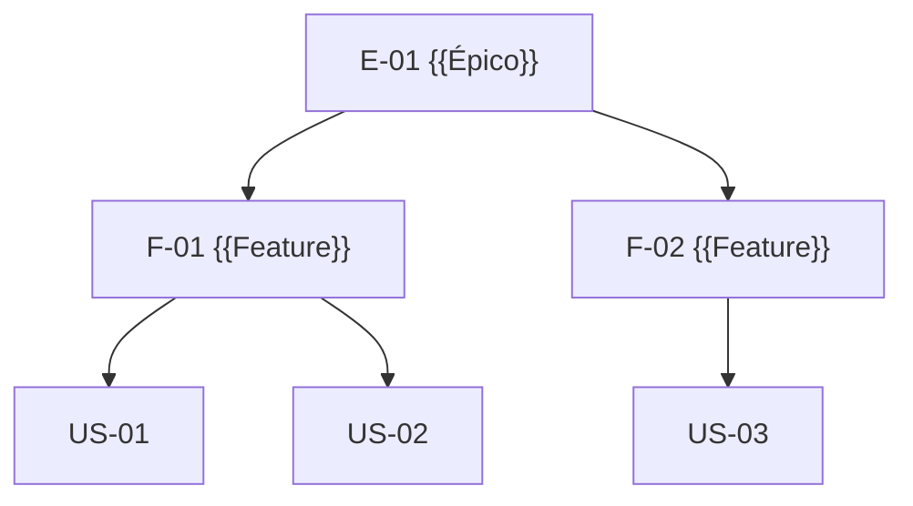

# User Stories e Backlog — {{PROJETO}}

## Convenções

**Formato:** `Como <persona>, quero <capacidade>, para <benefício>.`
**Título:** verbo + objeto (ex.: "Exportar relatório em CSV")
**ID:** `US-nn`

### Definition of Ready (DoR) — a story pode entrar em sprint quando:
- [ ] Valor para o utilizador claro (o "para" não é "porque sim")
- [ ] Critérios de aceitação escritos e testáveis
- [ ] Dependências identificadas e desbloqueadas
- [ ] Design/protótipo disponível quando aplicável
- [ ] Estimada pela equipa
- [ ] Cabe num sprint

### Definition of Done (DoD) — a story está feita quando:
- [ ] Código revisto e integrado na branch principal
- [ ] Testes automáticos escritos e a passar
- [ ] Critérios de aceitação verificados pelo PO
- [ ] Acessibilidade verificada (teclado + contraste)
- [ ] Documentação atualizada
- [ ] Instrumentação/analítica implementada
- [ ] Sem regressões conhecidas
- [ ] Implantado em {{staging}}

### INVEST — checklist por story
Independente · Negociável · Valiosa · Estimável · Small · Testável

---

## Épico E-01 — {{Nome do épico}}

**Objetivo:** {{...}}
**Métrica de sucesso:** {{...}}
**PRD:** [PRD-001](../00-produto/03-prd.md)



---

### US-01 — {{Título}}

> Como **{{gestor de encomendas}}**, quero **{{filtrar encomendas por estado e prazo}}**, para **{{atuar primeiro nas que estão em risco}}**.

| | |
|---|---|
| Épico | E-01 |
| Prioridade | Must |
| Estimativa | {{5}} pontos |
| Sprint | {{12}} |
| Requisitos | RF-07, RNF-01 |
| Caso de uso | [UC-03](../02-analise/01-use-cases.md) |
| Protótipo | {{link Figma}} |

**Critérios de aceitação**
```gherkin
Funcionalidade: Filtrar encomendas

  Contexto:
    Dado que estou autenticado como "gestor de encomendas"
    E existem 50 encomendas em estados variados

  Cenário: Filtrar por estado
    Quando seleciono o estado "Em atraso"
    Então vejo apenas encomendas em atraso
    E o contador indica o número de resultados

  Cenário: Combinar filtros
    Quando seleciono o estado "Em atraso" e o prazo "Próximos 7 dias"
    Então vejo apenas encomendas que cumprem ambos os critérios

  Cenário: Sem resultados
    Quando aplico filtros sem correspondência
    Então vejo a mensagem "Nenhuma encomenda corresponde aos filtros"
    E tenho a opção "Limpar filtros"

  Cenário: Persistência dos filtros
    Dado que apliquei filtros
    Quando navego para outra página e regresso
    Então os filtros permanecem aplicados
```

**Notas técnicas:** {{índice em (estado, prazo); paginação server-side}}
**Fora do âmbito:** {{guardar filtros como vistas nomeadas → US-09}}
**Riscos/dúvidas:** {{...}}

---

### US-02 — {{Título}}
{{Repetir estrutura}}

---

## Spikes (investigação com tempo limitado)

### SPK-01 — {{Avaliar viabilidade de X}}
| | |
|---|---|
| Pergunta a responder | {{...}} |
| Timebox | {{2 dias}} |
| Entregável | {{Documento comparativo + recomendação + protótipo descartável}} |
| Critério de conclusão | {{Equipa consegue decidir entre A e B}} |

---

## Dívida técnica

| ID | Descrição | Impacto se não resolver | Esforço | Prioridade |
|---|---|---|---|---|
| DT-01 | {{...}} | {{...}} | {{M}} | {{Alta}} |

---

## Backlog resumido

| ID | Título | Tipo | Prioridade | Estimativa | Estado |
|---|---|---|---|---|---|
| US-01 | {{...}} | Story | Must | 5 | Pronta |
| US-02 | {{...}} | Story | Should | 3 | Em refinamento |
| DT-01 | {{...}} | Dívida | — | 8 | Backlog |
| BUG-01 | {{...}} | Bug | Must | 2 | Em curso |
