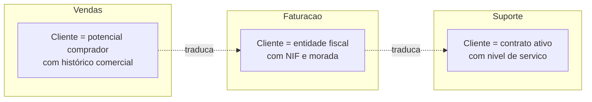

# Glossário e Linguagem Ubíqua — {{PROJETO}}

> Um termo, uma definição, em todo o lado: conversas, requisitos, código, base de dados e interface. Quando o negócio diz "Encomenda", a classe chama-se `Encomenda` — não `OrderEntity` nem `Pedido`.

**Responsável pelo glossário:** {{Nome}} · **Última revisão:** {{AAAA-MM-DD}}

---

## Termos de domínio

### {{Encomenda}}
| | |
|---|---|
| **Definição** | {{Pedido formal de um cliente para fornecimento de produtos, com preço e prazo acordados.}} |
| **Não confundir com** | {{Orçamento (sem compromisso) · Guia de remessa (documento de expedição)}} |
| **Sinónimos rejeitados** | {{"Pedido", "Order" — usar sempre "Encomenda"}} |
| **Identificado por** | {{Número de encomenda, formato `ENC-AAAA-nnnnn`}} |
| **Estados possíveis** | {{Rascunho → Submetida → Aprovada → Em preparação → Expedida → Entregue / Cancelada}} |
| **Regras associadas** | RN-02, RN-05 |
| **No código** | `Encomenda` (agregado) · tabela `encomendas` |
| **Dono do conceito** | {{Departamento Comercial}} |

### {{Cliente}}
| | |
|---|---|
| **Definição** | {{...}} |
| **Não confundir com** | {{Utilizador (quem acede ao sistema) — um cliente pode ter vários utilizadores}} |
| **No código** | `Cliente` |

---

## Termos ambíguos resolvidos

| Termo | Usado por | Significado A | Significado B | **Decisão** |
|---|---|---|---|---|
| {{"Fecho"}} | {{Contabilidade}} | {{Fecho contabilístico mensal}} | {{Conclusão de uma encomenda}} | {{"Fecho contabilístico" vs "Conclusão de encomenda" — nunca só "fecho"}} |

---

## Acrónimos

| Acrónimo | Significado | Contexto |
|---|---|---|
| RTM | Requirements Traceability Matrix | Análise |
| SLO | Service Level Objective | Operação |
| {{ERP}} | {{Enterprise Resource Planning — sistema {{X}}}} | {{Integração}} |

---

## Termos técnicos com significado específico neste projeto

| Termo | Significado aqui | Cuidado |
|---|---|---|
| {{"Ativo"}} | {{Utilizador com sessão nos últimos 30 dias}} | {{Não é o mesmo que "não eliminado"}} |
| {{"Tenant"}} | {{Organização cliente com dados isolados}} | |

---

## Contextos delimitados (Bounded Contexts)

> O mesmo termo pode legitimamente significar coisas diferentes em contextos diferentes. Documenta-o em vez de forçar uma definição única.

| Termo | Contexto | Significado | Mapeamento entre contextos |
|---|---|---|---|
| Cliente | Vendas | {{Lead qualificado ou comprador}} | `cliente_id` → `entidade_fiscal_id` |
| Cliente | Faturação | {{Entidade com NIF}} | |
