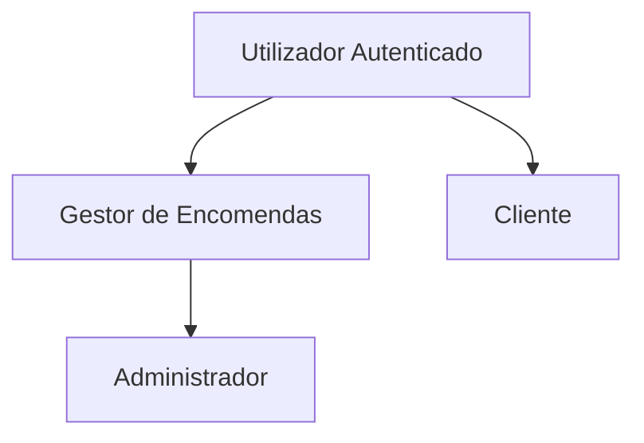
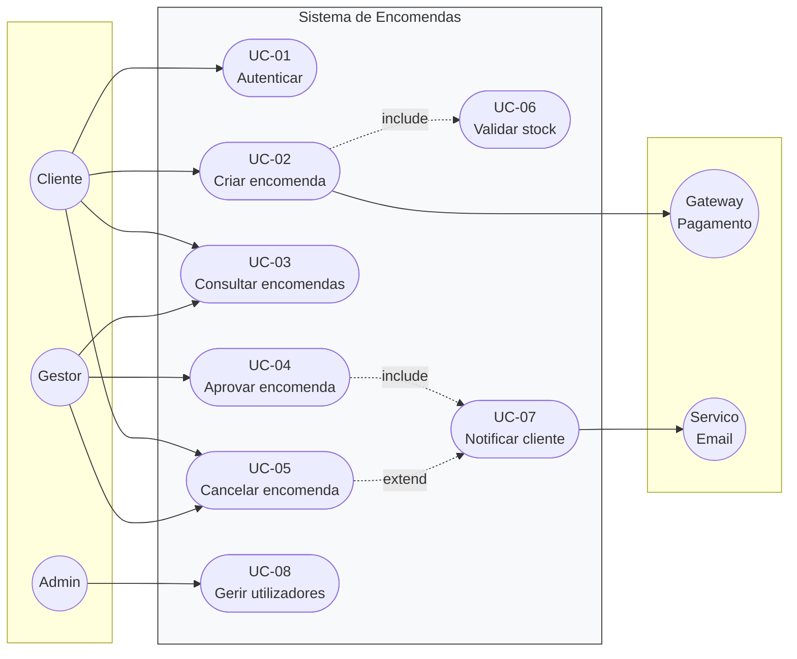

# Casos de Uso — {{PROJETO}}

**Versão:** {{0.1}} · **Data:** {{AAAA-MM-DD}} · **Autor:** {{Nome}}

---

## 1. Atores

### Atores primários (iniciam casos de uso)
| Ator | Tipo | Descrição | Objetivos |
|---|---|---|---|
| {{Gestor de Encomendas}} | Humano | {{...}} | {{Garantir entregas no prazo}} |
| {{Cliente}} | Humano | {{...}} | {{Acompanhar a sua encomenda}} |
| {{Agendador}} | Sistema | {{Processo automático diário}} | {{Executar rotinas noturnas}} |

### Atores secundários (participam mas não iniciam)
| Ator | Tipo | Papel |
|---|---|---|
| {{Gateway de Pagamento}} | Sistema externo | {{Autoriza e captura pagamentos}} |
| {{Serviço de E-mail}} | Sistema externo | {{Entrega notificações}} |

### Hierarquia de atores

---

## 2. Diagrama de casos de uso

**Relações usadas**
- `include` — o caso base **sempre** executa o incluído (fatorização de comportamento comum)
- `extend` — o caso extensão executa **condicionalmente**, a partir de um ponto de extensão
- `generalization` — especialização de um caso de uso ou ator

---

## 3. Índice de casos de uso

| ID | Nome | Ator primário | Prioridade | Complexidade | Requisitos | Estado |
|---|---|---|---|---|---|---|
| UC-01 | Autenticar utilizador | Cliente, Gestor | Must | Baixa | RF-01 | Aprovado |
| UC-02 | Criar encomenda | Cliente | Must | Alta | RF-06, RF-07 | Aprovado |
| UC-03 | Consultar encomendas | Cliente, Gestor | Must | Média | RF-08 | Rascunho |

---

## 4. Especificações detalhadas

### UC-01 — Autenticar utilizador

| Campo | Valor |
|---|---|
| **ID** | UC-01 |
| **Nome** | Autenticar utilizador |
| **Ator primário** | {{Utilizador registado}} |
| **Atores secundários** | {{Serviço de Identidade}} |
| **Objetivo** | {{Obter acesso às funcionalidades reservadas}} |
| **Âmbito** | {{Sistema de Encomendas}} |
| **Nível** | Objetivo de utilizador |
| **Prioridade** | Must |
| **Frequência de uso** | {{~2000 vezes/dia; pico às 9h}} |
| **Requisitos** | RF-01, RNF-13, RNF-17 |
| **Regras de negócio** | RN-01, RN-08 |

**Pré-condições**
1. O utilizador tem conta ativa no sistema.
2. O sistema está disponível.

**Pós-condições de sucesso**
1. Existe uma sessão autenticada associada ao utilizador.
2. O evento de autenticação foi registado no log de auditoria.

**Pós-condições de insucesso**
1. Nenhuma sessão é criada.
2. A tentativa falhada é registada e contabilizada.

**Gatilho (trigger)**
{{O utilizador acede a uma página que exige autenticação, ou clica em "Entrar".}}

---

#### Fluxo principal (caminho feliz)

| # | Ator | Sistema |
|---|---|---|
| 1 | Acede ao formulário de autenticação. | Apresenta os campos e-mail e palavra-passe. |
| 2 | Introduz credenciais e submete. | — |
| 3 | — | Valida o formato dos dados. |
| 4 | — | Verifica as credenciais contra o serviço de identidade. |
| 5 | — | Cria a sessão e regista o evento de auditoria. |
| 6 | — | Redireciona para o painel principal. |

---

#### Fluxos alternativos

**A1 — Utilizador já autenticado** *(no passo 1)*
1. O sistema deteta sessão válida.
2. Redireciona diretamente para o painel principal.
3. *Fim do caso de uso.*

**A2 — Autenticação via SSO** *(no passo 2)*
1. O utilizador escolhe "Entrar com {{fornecedor}}".
2. O sistema redireciona para o fornecedor de identidade.
3. O fornecedor devolve a asserção de identidade.
4. *Regressa ao passo 5 do fluxo principal.*

**A3 — MFA exigido** *(após o passo 4)*
1. O sistema deteta que o papel do utilizador exige MFA (RN-08).
2. Solicita o código de segundo fator.
3. O utilizador introduz o código.
4. O sistema valida o código.
5. *Regressa ao passo 5 do fluxo principal.*
   - 4a. Código inválido: até 3 tentativas; depois → E3.

---

#### Fluxos de exceção

**E1 — Credenciais inválidas** *(no passo 4)*
1. O sistema apresenta "Credenciais inválidas" (mensagem genérica — RNF-13).
2. Incrementa o contador de tentativas falhadas.
3. *Regressa ao passo 1.*

**E2 — Conta bloqueada** *(no passo 4)*
1. O sistema deteta 5 tentativas falhadas em 15 min (RN-01).
2. Bloqueia o acesso por 15 minutos e notifica o utilizador por e-mail.
3. *Fim do caso de uso com insucesso.*

**E3 — Serviço de identidade indisponível** *(no passo 4)*
1. O sistema deteta timeout após {{3 s}}.
2. Apresenta "Serviço temporariamente indisponível. Tenta novamente."
3. Regista o incidente e dispara alerta.
4. *Fim do caso de uso com insucesso.*

**E4 — Conta desativada** *(no passo 4)*
1. O sistema apresenta mensagem genérica (não revela o motivo).
2. *Fim do caso de uso com insucesso.*

---

#### Requisitos especiais
| Tipo | Requisito |
|---|---|
| Desempenho | Resposta em ≤ {{1 s}} p95 |
| Segurança | Proteção contra enumeração de contas e força bruta |
| Acessibilidade | Formulário navegável só com teclado; erros anunciados por leitor de ecrã |

#### Dados envolvidos
| Campo | Tipo | Obrigatório | Validação |
|---|---|---|---|
| E-mail | texto | Sim | Formato de e-mail; máx. 254 caracteres |
| Palavra-passe | texto | Sim | Mín. 12 caracteres |

#### Questões em aberto
| # | Questão | Responsável |
|---|---|---|
| Q-01 | {{Manter "lembrar-me"? Implicação de segurança?}} | {{Nome}} |

---

### UC-02 — {{Criar encomenda}}
{{Repetir a estrutura completa}}

---

## 5. Casos de uso ao nível de sistema (opcional)

Para casos de uso de mais baixo nível (sub-funções), pode usar-se o formato resumido:

### UC-06 — Validar stock *(formato breve)*
**Ator:** Sistema (incluído por UC-02)
**Fluxo:** O sistema consulta a disponibilidade de cada linha da encomenda no serviço de inventário; se todas as linhas têm stock, devolve OK; caso contrário devolve a lista de linhas insuficientes.
**Exceção:** Serviço de inventário indisponível → assume indisponível e sinaliza para revisão manual (RN-11).
