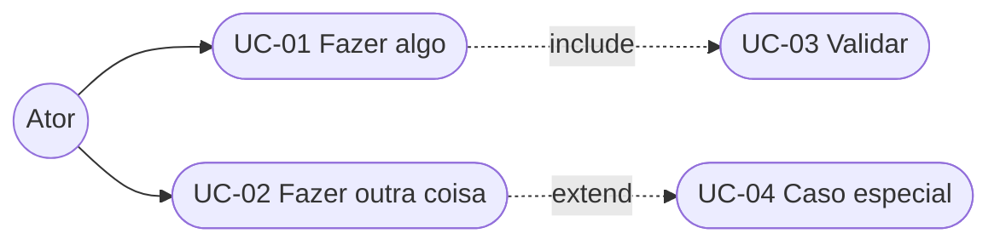
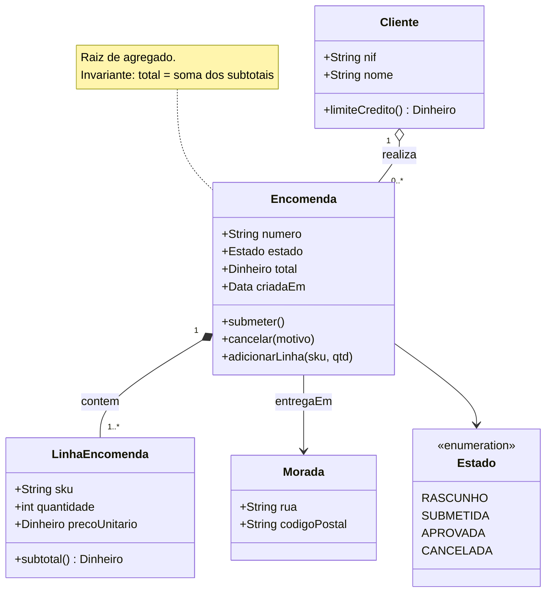
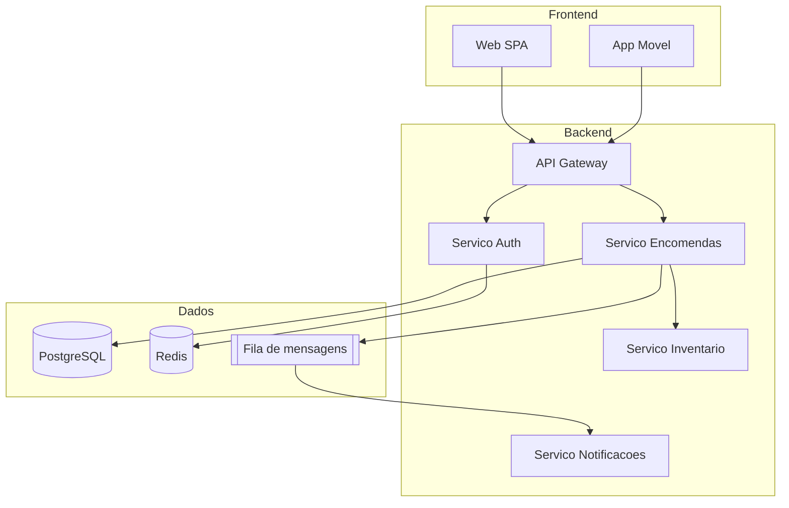
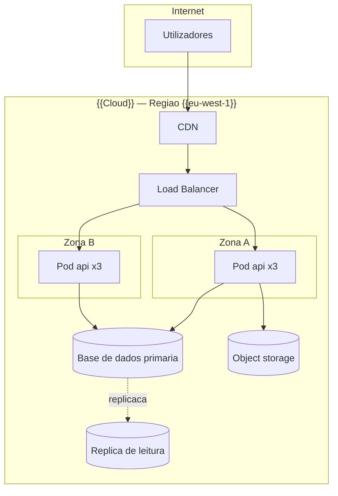
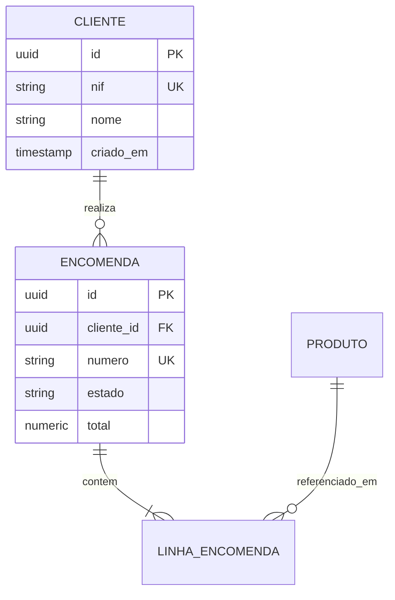
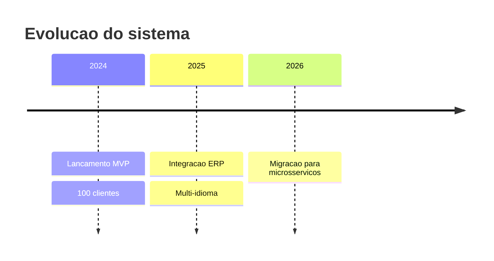
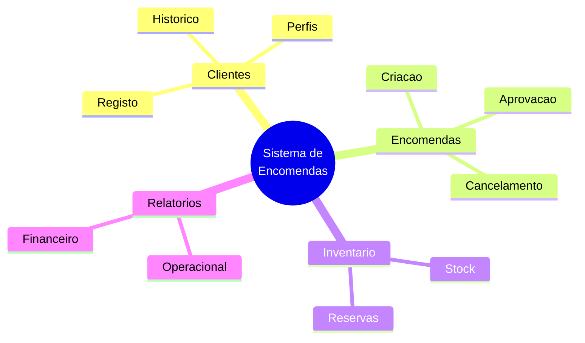

# Guia de Diagramas UML e de Modelação

> Referência prática: **quando** usar cada diagrama, e sintaxe Mermaid pronta a copiar.

---

## Escolher o diagrama certo

| Pergunta que queres responder | Diagrama |
|---|---|
| Quem usa o sistema e para quê? | Casos de uso |
| Qual é a sequência de passos de um processo? | Fluxograma / atividade |
| Quem é responsável por cada passo? | Fluxograma com raias |
| Que mensagens trocam os componentes, e por que ordem? | Sequência |
| Em que estados pode estar esta entidade? | Estados |
| Que conceitos existem e como se relacionam? | Classes / domínio |
| Como estão os dados estruturados? | Entidade-Relação |
| Como é que o sistema está montado? | C4 / componentes / implantação |
| O que sente o utilizador ao longo do percurso? | User journey |
| Onde é que o tempo se perde? | Value stream / fluxograma anotado |

---

## 1. Casos de uso

**Regras:** o nome do caso de uso é sempre `verbo + objeto` na perspetiva do ator; evita nomes técnicos ("Gravar registo na BD" não é caso de uso).

---

## 2. Classes / modelo de domínio

**Notação de relações**
| Símbolo | Significado |
|---|---|
| `*--` | Composição — a parte não existe sem o todo |
| `o--` | Agregação — a parte existe independentemente |
| `-->` | Associação direcionada |
| `<|--` | Herança |
| `..>` | Dependência |

---

## 3. Componentes

---

## 4. Implantação (deployment)

---

## 5. Entidade-Relação

**Cardinalidade:** `||` exatamente um · `o|` zero ou um · `}|` um ou muitos · `o{` zero ou muitos

---

## 6. Timeline / marcos

---

## 7. Mapa mental (exploração inicial)

---

## 8. Dicas de manutenção

- **Diagrama desatualizado é pior que nenhum.** Se não conseguires manter, gera-o a partir do código (ex.: `openapi` → diagramas, ferramentas de introspeção de BD).
- Mantém os diagramas **junto do código** que descrevem, não num wiki separado.
- Um diagrama = uma mensagem. Se precisas de legenda de 10 linhas, divide-o.
- Evita caracteres acentuados dentro de nós Mermaid em alguns renderizadores antigos; usa aspas `["Texto com acentuação"]` quando necessário.
- Verifica a renderização no destino final antes de dar por concluído.
