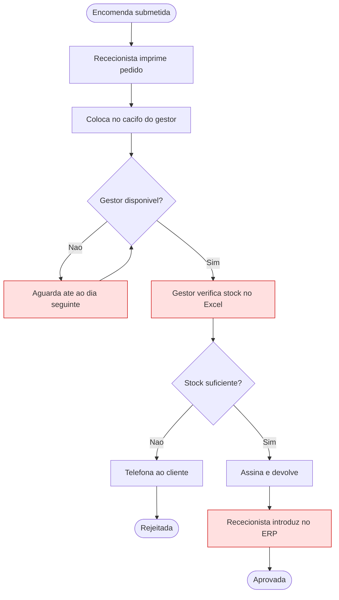
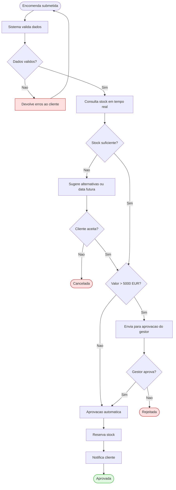
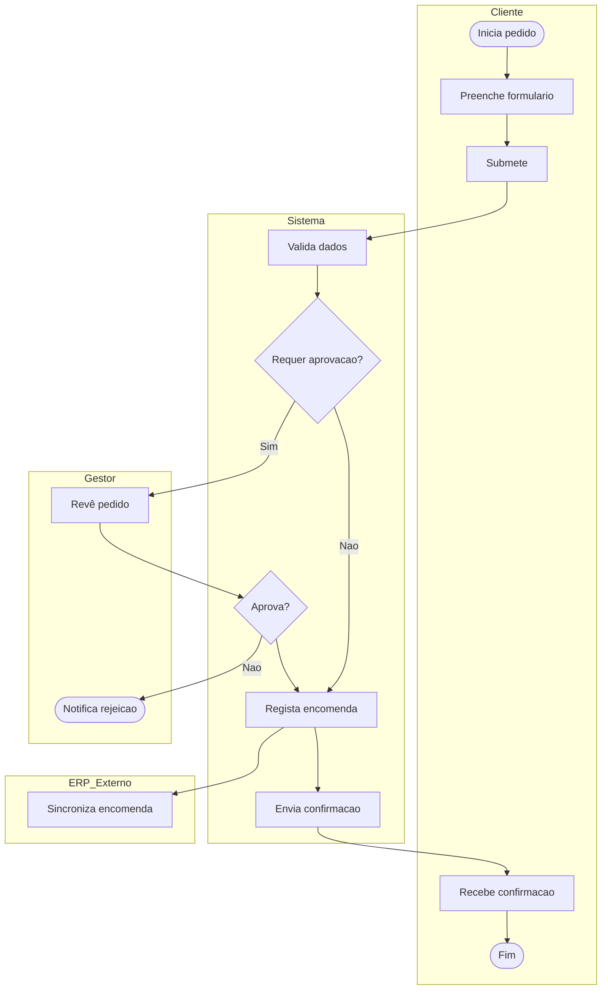
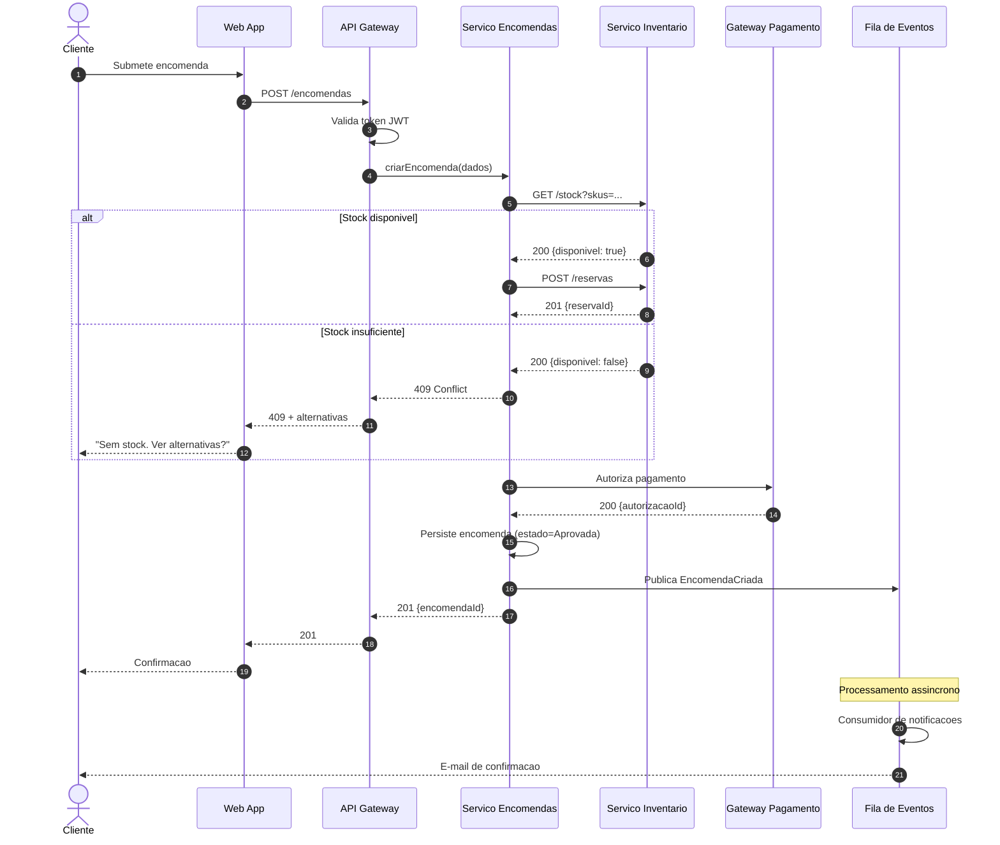
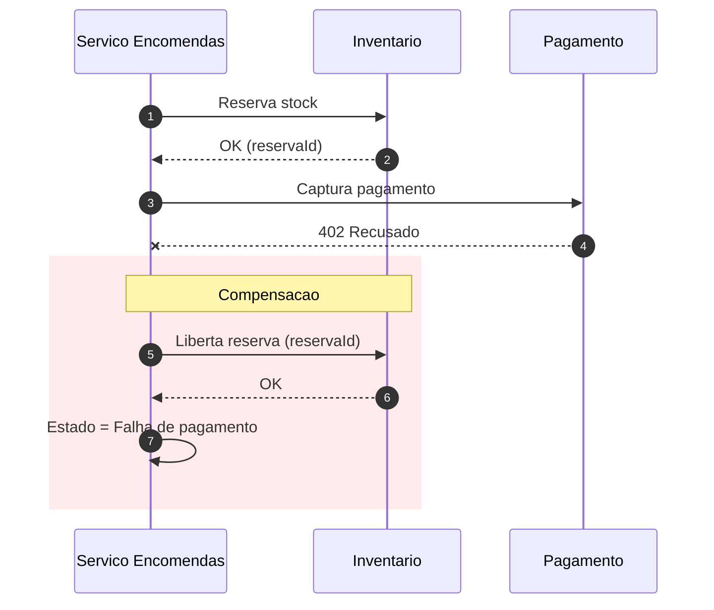
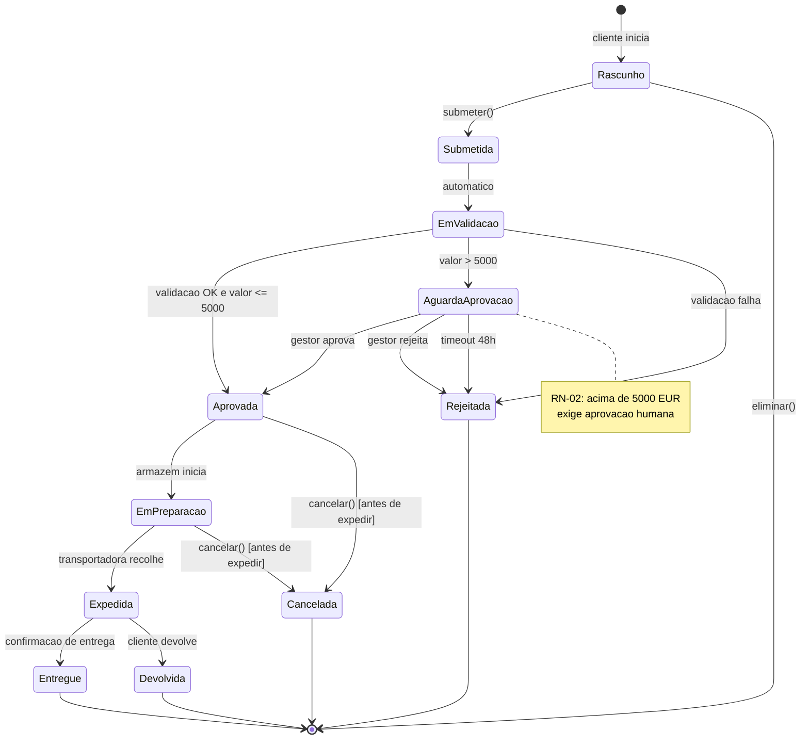
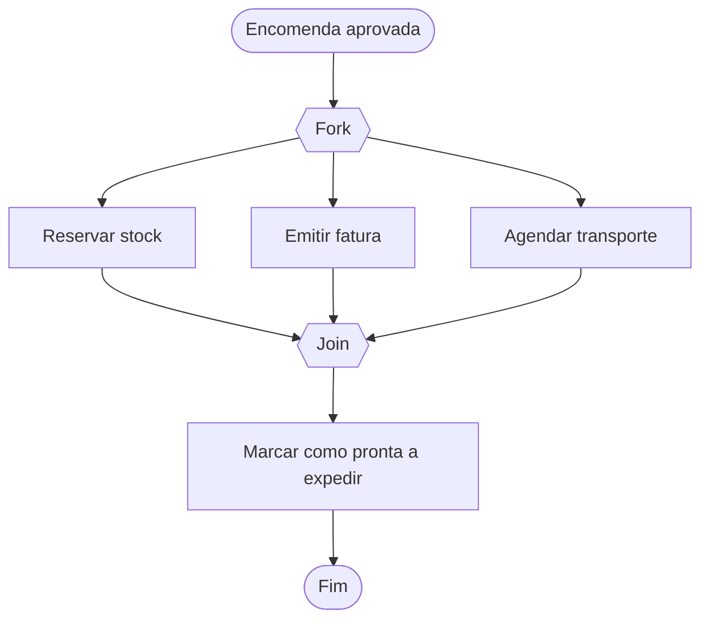
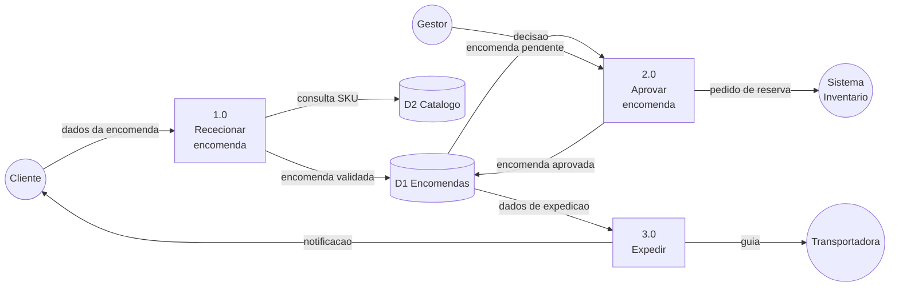
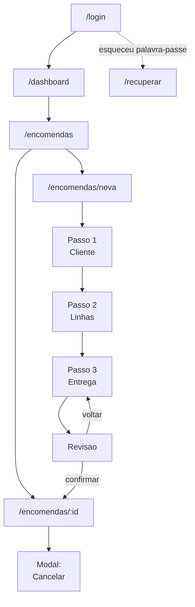
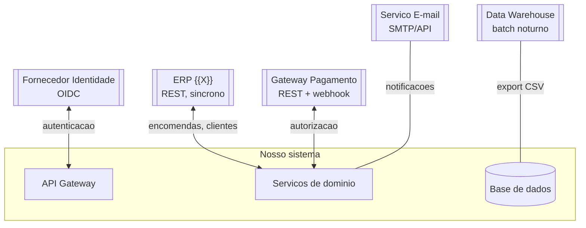

# Fluxos e Processos — Catálogo de Diagramas

> Todos os diagramas em **Mermaid** para viverem no controlo de versões e serem revistos em PR. Renderizam no GitHub, GitLab e na maioria dos wikis.

**Convenções**
- Um diagrama por processo; se não cabe num ecrã, decompõe-se.
- Losango = decisão · Retângulo = atividade · Estádio `([ ])` = início/fim · Paralelogramo = dados
- Caminhos de erro assinalados a vermelho.
- Cada diagrama indica: âmbito, atores, gatilho e resultado.

---

## 1. Fluxograma de processo (as-is / to-be)

### 1.1 Processo atual (AS-IS) — {{Aprovação de encomenda}}

**Gatilho:** {{Cliente submete encomenda}} · **Resultado:** {{Encomenda aprovada ou rejeitada}}
**Tempo médio atual:** {{4 h}} · **Pontos de dor:** {{passos 3 e 5 são manuais}}

### 1.2 Processo futuro (TO-BE)

**Tempo-alvo:** {{5 min}} · **Ganho esperado:** {{eliminação de 3 passos manuais}}

### 1.3 Comparação as-is / to-be
| Aspeto | AS-IS | TO-BE | Ganho |
|---|---|---|---|
| Passos manuais | {{5}} | {{1}} | {{−80%}} |
| Tempo médio | {{4 h}} | {{5 min}} | {{−98%}} |
| Taxa de erro | {{8%}} | {{<1%}} | |

---

## 2. Fluxo com raias (swimlanes) — responsabilidades

> Usa quando importa **quem** faz o quê. Cada raia é um ator, papel ou sistema.

---

## 3. Diagrama de sequência — interação entre componentes

> Mostra **ordem temporal** de mensagens. Ideal para APIs, integrações e fluxos assíncronos.

### 3.1 Sequência de erro / compensação (saga)

---

## 4. Diagrama de estados — ciclo de vida de uma entidade

> Responde a: em que estados pode estar? que transições são legítimas? quem as pode fazer?

### 4.1 Tabela de transições

| Estado origem | Evento | Guarda | Estado destino | Quem pode | Efeito colateral |
|---|---|---|---|---|---|
| Rascunho | submeter | linhas ≥ 1 | Submetida | Cliente | — |
| EmValidacao | — | valor ≤ 5000 | Aprovada | Sistema | Reserva stock; e-mail |
| AguardaAprovacao | aprovar | — | Aprovada | Gestor | Reserva stock; e-mail; auditoria |
| AguardaAprovacao | timeout | 48 h | Rejeitada | Sistema | E-mail; liberta pré-reserva |
| Aprovada | cancelar | ainda não expedida | Cancelada | Cliente, Gestor | Liberta stock; estorna pagamento |

### 4.2 Transições proibidas (testar explicitamente)
| Tentativa | Resultado esperado |
|---|---|
| Expedida → Rascunho | Erro `TRANSICAO_INVALIDA` |
| Cancelada → qualquer | Erro `ESTADO_TERMINAL` |

---

## 5. Diagrama de atividade com decisões paralelas

---

## 6. Fluxo de dados (DFD nível 1)

---

## 7. Fluxo de navegação / ecrãs (UI flow)

**Estados por ecrã a especificar:** vazio · a carregar · com dados · erro · sem permissão · offline

---

## 8. Mapa de integrações

| Sistema | Direção | Protocolo | Frequência | Volume | Dono | Falha tolerada? |
|---|---|---|---|---|---|---|
| {{ERP}} | Bidirecional | REST/JSON | Tempo real | {{500/dia}} | {{Equipa X}} | Não — bloqueia criação |
| {{Pagamento}} | Saída + webhook | REST | Tempo real | {{300/dia}} | {{Fornecedor}} | Não |
| {{E-mail}} | Saída | API | Assíncrono | {{2000/dia}} | {{Fornecedor}} | Sim — fila com retry |
| {{DW}} | Saída | SFTP | Diário 02:00 | {{~1 GB}} | {{Equipa BI}} | Sim — recupera no dia seguinte |
