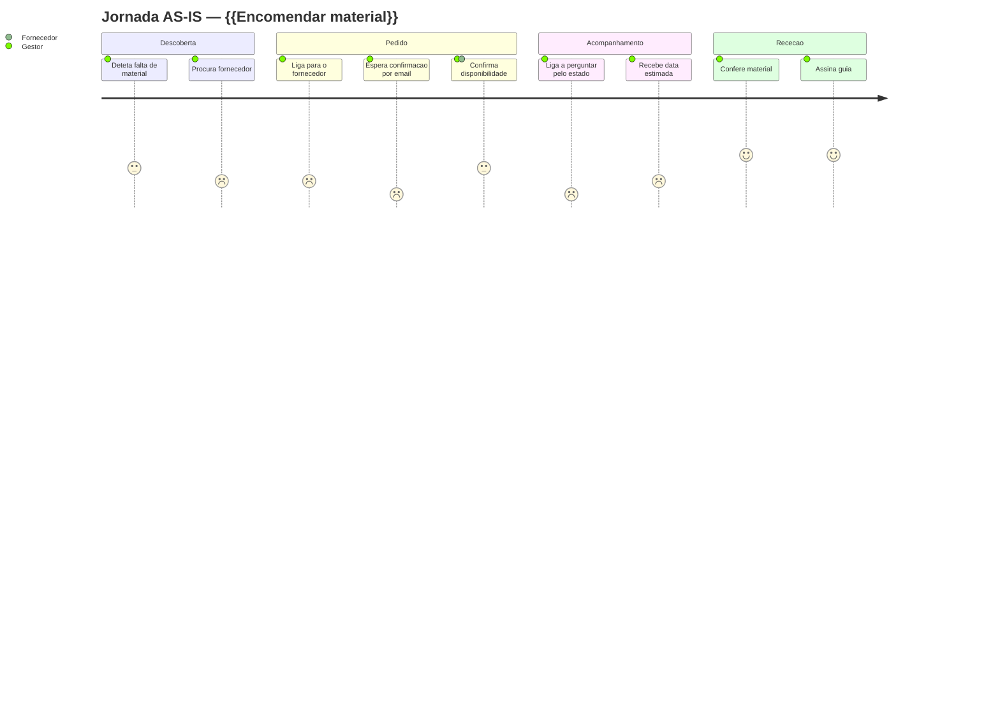
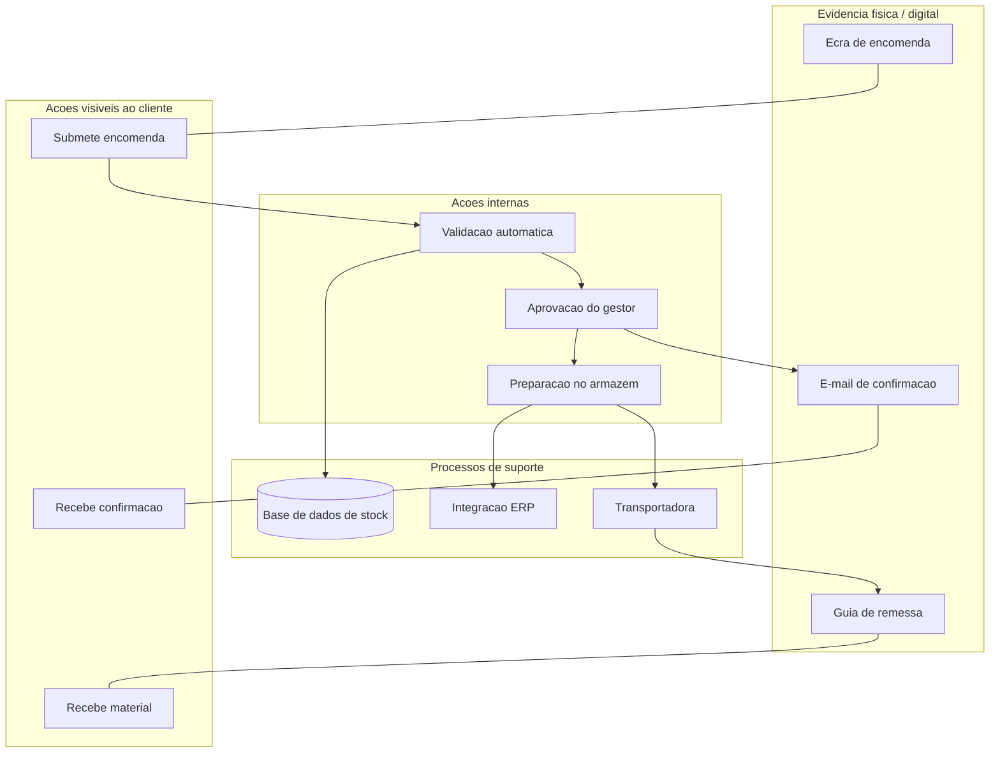

# User Journey Map — {{PERSONA}} / {{CENÁRIO}}

| | |
|---|---|
| Persona | [{{Nome}}](../00-produto/02-personas.md) |
| Cenário | {{Encomendar material urgente para obra}} |
| Objetivo da persona | {{Receber o material amanhã}} |
| Âmbito | Do {{momento em que deteta a falta}} até {{à receção}} |
| Estado | AS-IS / TO-BE |
| Base de evidência | {{8 entrevistas + analytics}} |

---

## 1. Mapa resumido

*(escala 1 = muito frustrante … 5 = excelente)*

---

## 2. Mapa detalhado por fase

### Fase 1 — {{Descoberta da necessidade}}

| Dimensão | Conteúdo |
|---|---|
| **O que a persona faz** | {{Verifica o stock em obra; confirma com a equipa}} |
| **O que pensa** | {{"Se não chegar amanhã, a obra para"}} |
| **O que sente** | 😟 Pressão · Nível de satisfação: **2/5** |
| **Pontos de contacto** | {{Folha de Excel; conversa presencial}} |
| **Canais** | {{Telemóvel, papel}} |
| **Tempo gasto** | {{20 min}} |
| **Dores** | {{Não sabe o stock real; a folha está desatualizada}} |
| **Oportunidade** | {{Alerta automático de stock mínimo}} → US-14 |
| **Bastidores (backstage)** | {{Ninguém atualiza a folha desde a semana passada}} |
| **Métrica** | {{% de ruturas detetadas tardiamente}} |

### Fase 2 — {{Pedido}}
{{Repetir a grelha}}

### Fase 3 — {{Acompanhamento}}
### Fase 4 — {{Receção}}

---

## 3. Momentos da verdade

> Passos onde a experiência é decidida — falhar aqui custa a relação.

| # | Momento | Porque é crítico | Estado atual | Alvo |
|---|---|---|---|---|
| M1 | {{Confirmação de disponibilidade}} | {{Determina se a obra para}} | {{Demora 4 h}} | {{Imediata}} |
| M2 | {{Primeira utilização do sistema}} | {{Define se volta a usar}} | — | {{Sucesso sem formação}} |

---

## 4. Pontos de atrito priorizados

| # | Atrito | Fase | Frequência | Severidade | Esforço de resolução | Prioridade |
|---|---|---|---|---|---|---|
| A1 | {{Não há visibilidade de stock}} | 1 | Diária | Alta | M | 1 |
| A2 | {{Confirmação por telefone}} | 2 | Diária | Média | S | 2 |

---

## 5. Service Blueprint (ligar frontstage e backstage)

**Linha de interação:** entre Frontstage e Backstage
**Linha de visibilidade:** o cliente não vê nada abaixo de Frontstage
**Linha de interação interna:** entre Backstage e Suporte

---

## 6. Jornada TO-BE

{{Repetir a estrutura com o desenho futuro e destacar as diferenças}}

| Fase | AS-IS (satisfação) | TO-BE (alvo) | Intervenção |
|---|---|---|---|
| Descoberta | 2/5 | 4/5 | {{Alerta automático}} |
| Pedido | 1/5 | 5/5 | {{Autosserviço com stock em tempo real}} |
