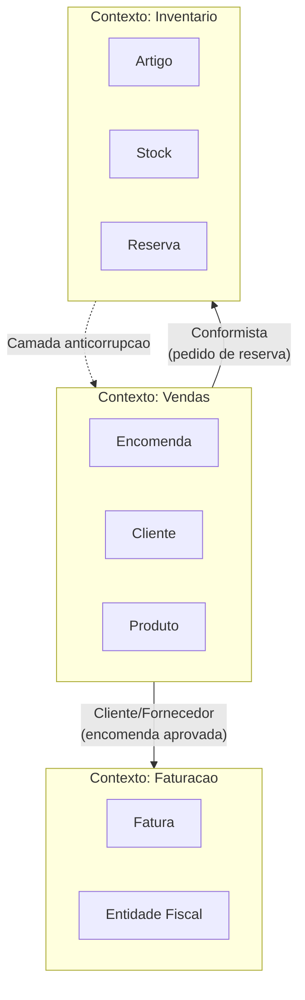
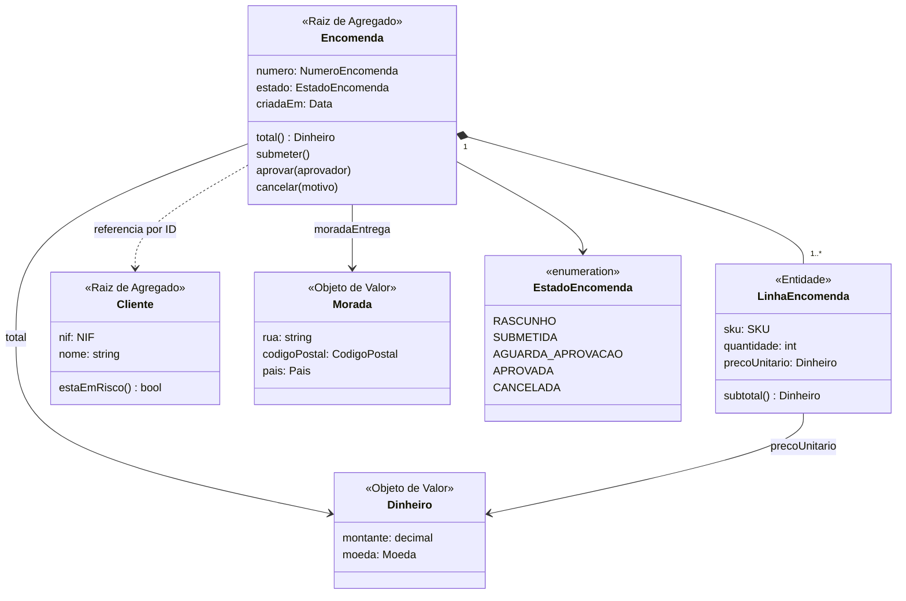
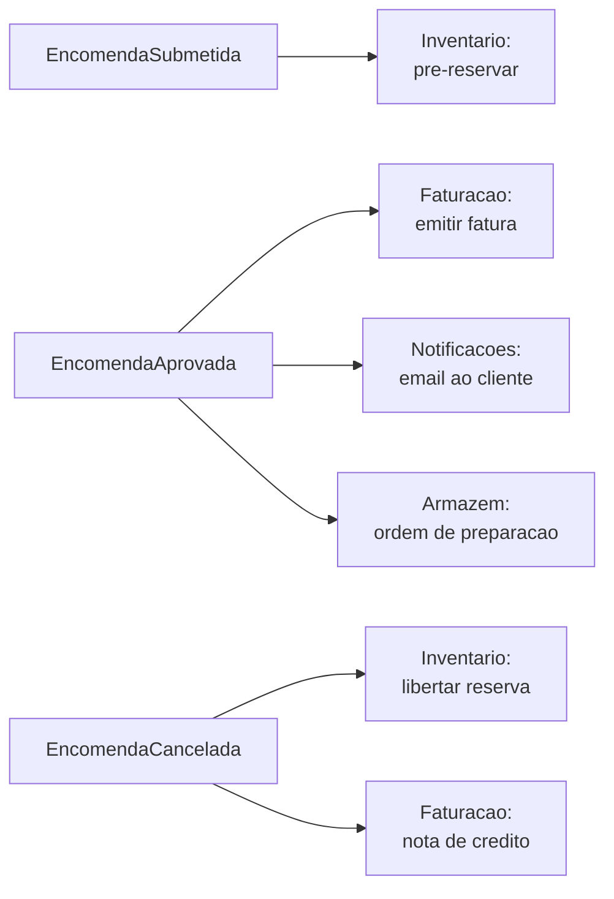

# Modelo de Domínio — {{PROJETO}}

> Modelo **conceptual**: representa o negócio, não a base de dados nem as classes de implementação. Usa a linguagem do [Glossário](../01-requisitos/06-glossario.md).

---

## 1. Contextos delimitados (Bounded Contexts)

### Mapa de contextos
| Contexto | Responsabilidade | Equipa | Relação com os outros |
|---|---|---|---|
| Vendas | {{Captar e gerir encomendas}} | {{Equipa A}} | Upstream de Faturação |
| Inventário | {{Disponibilidade e reservas}} | {{Equipa B}} | Fornecedor de Vendas |
| Faturação | {{Documentos fiscais}} | {{Equipa C}} | Downstream de Vendas |

**Padrões de integração usados:** Cliente/Fornecedor · Conformista · Camada Anticorrupção (ACL) · Núcleo Partilhado · Serviço Aberto

---

## 2. Modelo conceptual — contexto {{Vendas}}

---

## 3. Agregados

### Agregado: Encomenda
| | |
|---|---|
| **Raiz** | `Encomenda` |
| **Entidades internas** | `LinhaEncomenda` |
| **Objetos de valor** | `Dinheiro`, `Morada`, `NumeroEncomenda` |
| **Fronteira de consistência** | Todas as invariantes abaixo são garantidas numa transação |
| **Referências externas** | `Cliente` **por identificador**, nunca por objeto |

**Invariantes (sempre verdadeiras)**
1. Uma encomenda submetida tem pelo menos uma linha.
2. `total` = Σ subtotais + IVA − desconto + portes (RN-03).
3. Não existem duas linhas com o mesmo SKU (agregam-se em quantidade).
4. Uma encomenda em estado terminal não muda de estado.

**Regra de tamanho:** {{uma encomenda tem tipicamente 1-20 linhas, máximo 500}} — se crescer muito, repensar a fronteira.

### Agregado: Cliente
{{...}}

---

## 4. Objetos de valor

| Objeto | Componentes | Invariantes | Porque não é primitivo |
|---|---|---|---|
| `Dinheiro` | montante (decimal), moeda | Moeda obrigatória; sem somar moedas diferentes | Evita somar euros com dólares |
| `NIF` | 9 dígitos | Dígito de controlo válido | Valida na fronteira, não em toda a parte |
| `SKU` | string com formato `AAA-9999` | Formato validado | |
| `Email` | string | Formato + normalização em minúsculas | |

---

## 5. Eventos de domínio

| Evento | Quando ocorre | Payload | Consumidores |
|---|---|---|---|
| `EncomendaSubmetida` | Encomenda passa a Submetida | `{encomendaId, clienteId, total, timestamp}` | Inventário (pré-reserva) |
| `EncomendaAprovada` | Encomenda passa a Aprovada | `{encomendaId, aprovadorId, total}` | Faturação, Notificações, Armazém |
| `EncomendaCancelada` | Encomenda cancelada | `{encomendaId, motivo, canceladaPor}` | Inventário (libertar), Faturação (nota de crédito) |

---

## 6. Serviços de domínio

> Lógica que não pertence naturalmente a nenhuma entidade.

| Serviço | Responsabilidade | Porque não está numa entidade |
|---|---|---|
| `CalculadorDePrecos` | {{Aplica tabelas de preço, descontos e campanhas}} | {{Envolve Cliente, Produto e Campanha}} |
| `PoliticaDeAprovacao` | {{Determina quem tem de aprovar (RN-02)}} | {{Depende de configuração organizacional}} |

---

## 7. Do modelo de domínio ao modelo físico

| Conceito de domínio | Tabela / Coleção | Notas de mapeamento |
|---|---|---|
| `Encomenda` | `encomendas` | Raiz; `id` UUID |
| `LinhaEncomenda` | `linhas_encomenda` | FK `encomenda_id`, `ON DELETE CASCADE` |
| `Dinheiro` | colunas `total_cents` (bigint) + `moeda` (char 3) | Inteiro em cêntimos, nunca float |
| `Morada` | colunas embebidas `entrega_rua`, `entrega_cp`… | Objeto de valor, sem tabela própria |

> Modelo físico completo: [Modelo de Dados](../03-arquitetura/03-modelo-dados.md)
