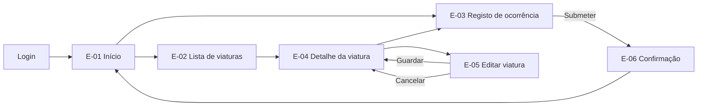

# Especificação de Interface — {{PROJETO}}

> **Estado:** {{rascunho | aprovado}} · **Data:** {{AAAA-MM-DD}} · **Dono:** {{nome}}
> **Origem:** [User Stories](../01-requisitos/04-user-stories.md) · [Casos de Uso](../02-analise/01-use-cases.md)

---

## 1. Para que serve

Este documento diz **o que cada ecrã faz**, não o que parece. O aspeto vive no
[Sistema de Design](03-design-system.md) e nos protótipos; aqui está o
comportamento — o que aparece, quando, com que dados, e o que acontece quando
corre mal.

É o documento que permite construir um ecrã sem perguntar nada a ninguém, e o
que permite testá-lo sem adivinhar qual era a intenção.

---

## 2. Inventário de ecrãs

| ID | Ecrã | Papel que acede | Caso de uso | Estado |
|---|---|---|---|---|
| E-01 | {{Início}} | {{Todos}} | {{UC-01}} | {{Especificado}} |
| E-02 | {{Lista de viaturas}} | {{Gestor}} | {{UC-03}} | {{Por especificar}} |
| E-03 | {{Registo de ocorrência}} | {{Condutor}} | {{UC-07}} | {{Especificado}} |

---

## 3. Mapa de navegação

**Regra:** de qualquer ecrã tem de haver caminho de volta sem usar o botão do
browser. Um beco sem saída é um defeito, não uma omissão de desenho.

---

## 4. Ficha de ecrã

> Repetir por cada ecrã do inventário.

### E-{{nn}} — {{Nome do ecrã}}

**Objetivo:** {{o que o utilizador vem aqui fazer, numa frase}}
**Quem acede:** {{papéis}} · **Chega de:** {{E-nn}} · **Vai para:** {{E-nn}}
**Dispositivo:** {{telemóvel | tablet | desktop | PDA}}

#### 4.1 Conteúdo

| Elemento | Tipo | Origem do dado | Obrigatório | Regra |
|---|---|---|---|---|
| {{Matrícula}} | {{Campo texto}} | {{utilizador}} | Sim | {{formato AA-00-AA, único}} |
| {{Marca}} | {{Lista}} | {{fleet_brand, ativas}} | Sim | {{ordenada por nome}} |
| {{Quilómetros}} | {{Campo numérico}} | {{utilizador}} | Sim | {{≥ leitura anterior}} |
| {{Custo total}} | {{Só leitura}} | {{calculado}} | — | {{soma das despesas não rejeitadas}} |

#### 4.2 Ações

| Ação | Quem pode | Efeito | Confirmação? | Depois vai para |
|---|---|---|---|---|
| {{Guardar}} | {{Gestor}} | {{Cria/atualiza}} | Não | {{E-04}} |
| {{Abater viatura}} | {{Gestor}} | {{Irreversível}} | **Sim, com escrita da matrícula** | {{E-02}} |

**Regra:** toda a ação destrutiva ou irreversível pede confirmação explícita, e
a confirmação nomeia o que vai ser afetado. "Tem a certeza?" não é confirmação.

#### 4.3 Estados do ecrã

Os cinco que se esquecem sempre. **Nenhum é opcional.**

| Estado | Quando ocorre | O que se mostra |
|---|---|---|
| **Vazio** | {{Não há viaturas registadas}} | {{Explicação + ação para criar a primeira}} |
| **A carregar** | {{Enquanto o pedido não responde}} | {{Esqueleto do conteúdo, não um círculo a girar}} |
| **Erro** | {{Falha de rede ou do servidor}} | {{O que falhou, o que fazer, botão de repetir}} |
| **Sem permissão** | {{Papel não autorizado}} | {{Dizer que não tem acesso; não esconder sem explicar}} |
| **Parcial** | {{Parte dos dados falhou}} | {{Mostrar o que há, assinalar o que falta}} |

#### 4.4 Validação e mensagens

| Campo | Regra | Quando valida | Mensagem |
|---|---|---|---|
| {{Matrícula}} | {{Formato}} | {{Ao sair do campo}} | {{"A matrícula tem o formato AA-00-AA."}} |
| {{Matrícula}} | {{Única}} | {{Ao submeter}} | {{"Já existe uma viatura com a matrícula AA-00-AA."}} |
| {{Quilómetros}} | {{≥ anterior}} | {{Ao escrever}} | {{"A última leitura foi 45 000 km, a 12/03."}} |

**Regras das mensagens:** dizem o que aconteceu e o que fazer a seguir, nomeiam
o valor em causa, e nunca culpam o utilizador. Detalhe em
[Conteúdo e Microcopy](05-conteudo-e-microcopy.md).

#### 4.5 Comportamento em ecrã pequeno

| Largura | Comportamento |
|---|---|
| {{< 640 px}} | {{Tabela vira lista de cartões; ações no fundo}} |
| {{640–1024 px}} | {{...}} |
| {{> 1024 px}} | {{...}} |

#### 4.6 Teclado e leitura

| Aspeto | Especificação |
|---|---|
| Ordem de tabulação | {{Segue a ordem visual, de cima para baixo}} |
| Foco inicial | {{Primeiro campo editável}} |
| Atalho de submissão | {{Enter no último campo}} |
| Anúncio de erro | {{Lido por leitor de ecrã ao aparecer}} |

Critérios completos em [Acessibilidade](04-acessibilidade.md).

---

## 5. Componentes partilhados

Elementos que aparecem em vários ecrãs e se especificam uma vez.

| Componente | Onde aparece | Comportamento |
|---|---|---|
| {{Cabeçalho}} | {{Todos}} | {{...}} |
| {{Seletor de viatura}} | {{E-03, E-05}} | {{Pesquisa por matrícula ou marca; mínimo 2 caracteres}} |
| {{Tabela paginada}} | {{E-02, E-06}} | {{25 por página; ordenação por coluna; mantém filtro ao voltar}} |

---

## 6. Rastreabilidade

| Ecrã | Requisito | Caso de uso | Critério de aceitação |
|---|---|---|---|
| E-03 | {{RF-12}} | {{UC-07}} | {{CA-07-01}} |
