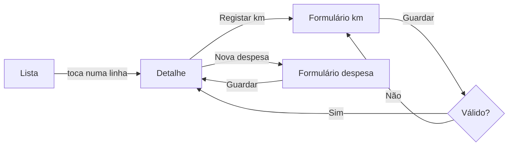

# Wireframes e Protótipo — {{PROJETO}}

> **Data:** {{AAAA-MM-DD}} · **Dono:** {{nome}}
> **Ferramenta:** {{Figma | Penpot | papel}} · **Ligação:** {{url}}

---

## 1. Níveis de fidelidade — e para que serve cada um

| Nível | O que mostra | O que **não** mostra | Serve para | Custo de mudar |
|---|---|---|---|---|
| **Esboço** (papel) | Blocos e fluxo | Cor, tipografia, texto real | Descartar ideias em minutos | Nenhum |
| **Baixa fidelidade** | Estrutura, hierarquia, navegação | Estilo visual | Validar o fluxo com utilizadores | Baixo |
| **Alta fidelidade** | Aspeto final, texto real, dados realistas | Comportamento completo | Aprovar o aspeto | Médio |
| **Protótipo navegável** | Fluxo clicável ponta a ponta | Lógica de negócio, dados reais | Testar com utilizadores antes de construir | Médio |

> **Erro comum:** saltar para alta fidelidade cedo demais. Um ecrã bonito é
> difícil de criticar — as pessoas comentam a cor em vez de dizerem que o fluxo
> não faz sentido. Baixa fidelidade convida à crítica que interessa.

---

## 2. Inventário

| ID | Ecrã | Fidelidade | Ligação | Validado com utilizadores | Estado |
|---|---|---|---|---|---|
| E-01 | {{Início}} | {{Alta}} | {{url}} | {{Sim — 3 pessoas}} | Aprovado |
| E-02 | {{Lista}} | {{Baixa}} | {{url}} | Não | Em revisão |

---

## 3. Wireframe em texto

Para quando o desenho tem de viver no repositório e sobreviver a mudanças de
ferramenta. Não substitui o protótipo — sobrevive-lhe.

```
┌────────────────────────────────────────────────┐
│  ← Voltar          {{Detalhe da viatura}}   ⋮  │
├────────────────────────────────────────────────┤
│  {{AA-00-AA}}                     [ Ativa ]   │
│  {{Renault Clio}} · {{Diesel}}                 │
│                                                │
│  ┌──────────────┬──────────────┬────────────┐  │
│  │ {{45 000 km}}│ {{1 240 €}}  │{{0,03 €/km}}│ │
│  │ Quilómetros  │ Custo total  │ Custo/km   │  │
│  └──────────────┴──────────────┴────────────┘  │
│                                                │
│  Condutor atual                               │
│  {{Nome}} · desde {{12/03/2026}}               │
│                                                │
│  Últimas despesas                     Ver todas│
│  ├ {{Combustível}}   {{60,00 €}}  {{12/03}}    │
│  ├ {{Portagens}}     {{ 8,40 €}}  {{11/03}}    │
│  └ {{Oficina}}       {{240,00 €}} {{02/03}}    │
│                                                │
│  [ Registar quilómetros ]  [ Nova despesa ]    │
└────────────────────────────────────────────────┘
```

**Anotações**

| # | Elemento | Nota |
|---|---|---|
| 1 | {{Estado "Ativa"}} | {{Cor só como reforço; o texto tem de bastar}} |
| 2 | {{Custo/km}} | {{Só aparece com ≥ 2 leituras de quilómetros}} |
| 3 | {{Botões}} | {{Fixos no fundo em ecrã pequeno}} |

---

## 4. Fluxo do protótipo



---

## 5. Teste com utilizadores

### 5.1 Guião

| # | Tarefa dada ao utilizador | O que se observa | Sucesso = |
|---|---|---|---|
| 1 | {{"Registe os quilómetros da sua viatura."}} | {{Encontra o botão sem ajuda?}} | {{< 30 s, sem perguntar}} |
| 2 | {{"Veja quanto gastou este mês."}} | {{Que caminho tenta primeiro?}} | {{Chega lá em ≤ 3 toques}} |

**Não se explica a interface antes.** Se for preciso explicar, é o resultado do
teste — e é um resultado importante.

### 5.2 Resultados

| Tarefa | Participantes | Concluíram | Tempo médio | Problemas observados |
|---|---|---|---|---|
| 1 | {{5}} | {{4}} | {{22 s}} | {{2 procuraram no menu}} |

### 5.3 Alterações decididas

| # | Problema | Alteração | Ecrã | Feito |
|---|---|---|---|---|
| 1 | {{...}} | {{...}} | {{E-04}} | {{☐}} |

---

## 6. Do protótipo ao código

| Verificação antes de construir | ☐ |
|---|---|
| Todos os ecrãs têm os cinco estados especificados (vazio, a carregar, erro, sem permissão, parcial) | ☐ |
| Textos reais, não *lorem ipsum* — o texto real muda a dimensão das coisas | ☐ |
| Dados realistas, incluindo os casos feios: nomes longos, valores negativos, listas de 500 linhas | ☐ |
| Testado no aparelho real, não só no browser | ☐ |
| Contraste verificado ([Acessibilidade](04-acessibilidade.md)) | ☐ |
