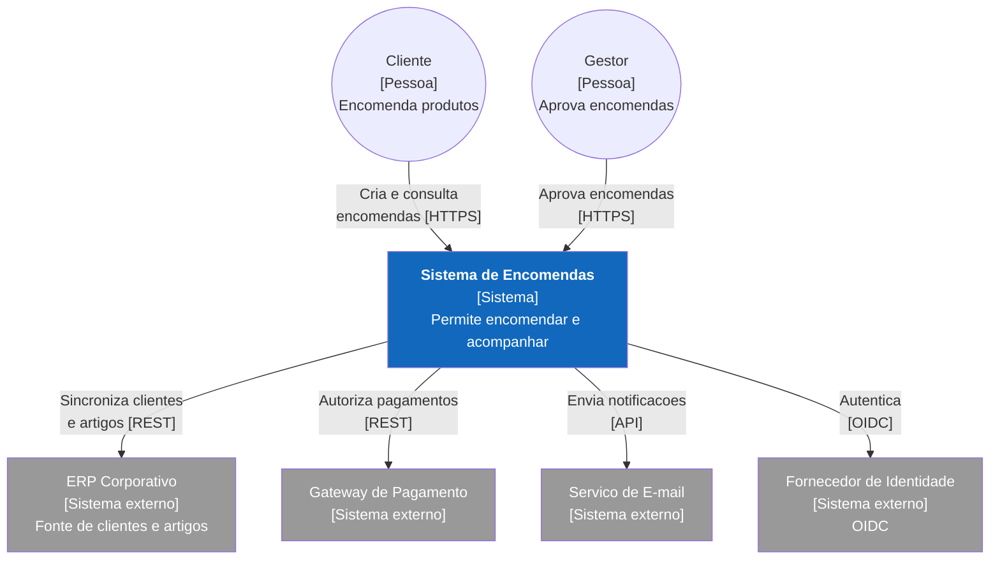
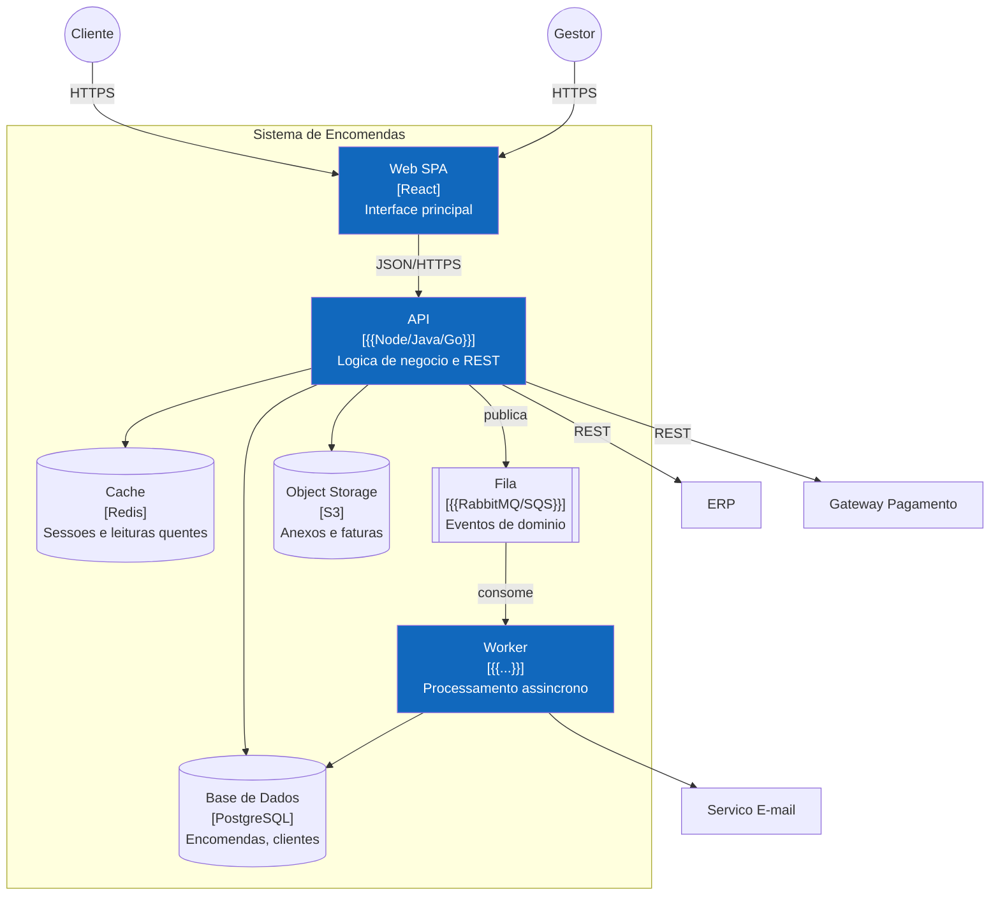
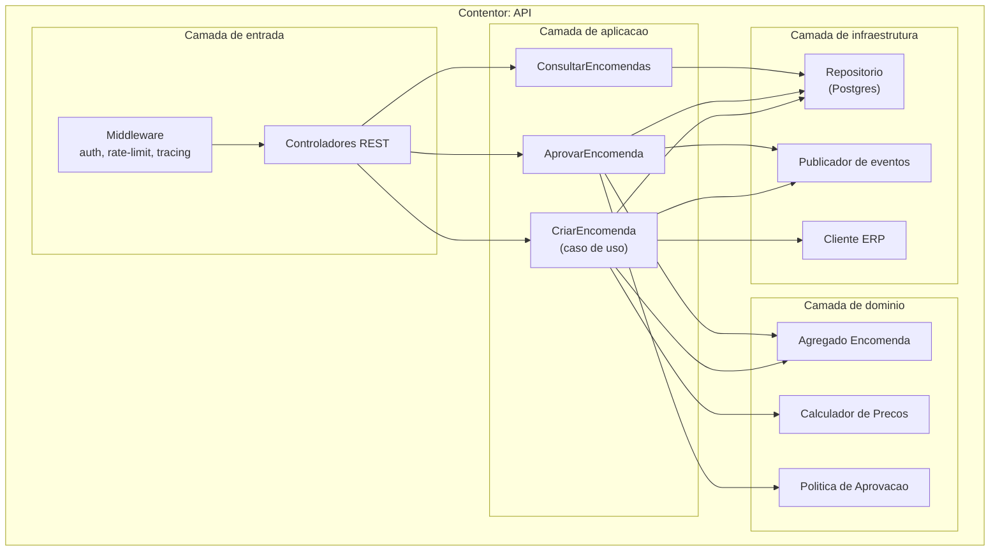

# Documento de Arquitetura de Software — {{PROJETO}}

| Campo | Valor |
|---|---|
| Versão | {{1.0}} |
| Data | {{AAAA-MM-DD}} |
| Arquiteto responsável | {{Nome}} |
| Estado | Rascunho / Aprovado |
| Revisores | {{...}} |

---

## 1. Introdução

### 1.1 Objetivo do documento
{{Para quem é e o que permite decidir.}}

### 1.2 Âmbito
{{Que sistemas cobre e quais ficam de fora.}}

### 1.3 Documentos relacionados
- [Visão de Produto](../00-produto/01-visao-produto.md)
- [Requisitos Não Funcionais](../01-requisitos/03-requisitos-nao-funcionais.md)
- [ADRs](adr/)

---

## 2. Objetivos e restrições arquiteturais

### 2.1 Atributos de qualidade priorizados
> A arquitetura é a materialização destas prioridades. Ordena-as — não podem ser todas primeiro.

| # | Atributo | Prioridade | Cenário concreto | RNF |
|---|---|---|---|---|
| 1 | {{Disponibilidade}} | Crítica | {{99,9% mensal; falha de uma AZ não interrompe serviço}} | RNF-07 |
| 2 | {{Segurança}} | Crítica | {{Dados pessoais cifrados; auditoria completa}} | RNF-11…17 |
| 3 | {{Desempenho}} | Alta | {{p95 ≤ 300 ms a 500 rps}} | RNF-01 |
| 4 | {{Manutenibilidade}} | Alta | {{Nova equipa produtiva em 2 semanas}} | RNF-33 |

### 2.2 Restrições

| Tipo | Restrição | Origem | Negociável? |
|---|---|---|---|
| Técnica | {{Tem de correr em {{cloud X}}}} | {{Contrato corporativo}} | Não |
| Técnica | {{Stack {{linguagem}} — competências da equipa}} | {{Equipa}} | Parcialmente |
| Organizacional | {{Equipa de 5 pessoas}} | {{Orçamento}} | Não |
| Legal | {{Dados residem na UE}} | {{RGPD}} | Não |
| Temporal | {{GA até {{data}}}} | {{Compromisso comercial}} | Não |

### 2.3 Princípios arquiteturais
| # | Princípio | Implicação prática |
|---|---|---|
| P1 | {{API-first}} | {{Contrato OpenAPI antes da implementação}} |
| P2 | {{Sem estado nos serviços}} | {{Sessão em Redis, ficheiros em object storage}} |
| P3 | {{Falhar rápido e visivelmente}} | {{Timeouts explícitos; sem retry infinito}} |
| P4 | {{Segurança por omissão}} | {{Negar acesso salvo autorização explícita}} |
| P5 | {{Simplicidade primeiro}} | {{Monólito modular até a evidência justificar dividir}} |

---

## 3. Vista de contexto (C4 — Nível 1)

---

## 4. Vista de contentores (C4 — Nível 2)

### Inventário de contentores
| Contentor | Tecnologia | Responsabilidade | Escala | Estado |
|---|---|---|---|---|
| Web SPA | {{React {{versão}}}} | Interface | CDN | Sem estado |
| API | {{...}} | Regras de negócio, REST | {{3–10 pods}} | Sem estado |
| Worker | {{...}} | Eventos, e-mail, relatórios | {{2–6 pods}} | Sem estado |
| PostgreSQL | {{versão}} | Persistência transacional | {{1 primária + 1 réplica}} | Com estado |
| Redis | {{versão}} | Sessões, cache | {{cluster 3 nós}} | Efémero |

---

## 5. Vista de componentes (C4 — Nível 3) — contentor `API`

**Regra de dependência:** as setas apontam sempre para dentro. O domínio não conhece infraestrutura.

---

## 6. Vista de dados
> Detalhe em [Modelo de Dados](03-modelo-dados.md)

| Aspeto | Decisão |
|---|---|
| Motor principal | {{PostgreSQL 16}} |
| Justificação | {{Transações ACID necessárias para invariantes de encomenda}} |
| Estratégia de migrações | {{Migrações versionadas, forward-only, compatíveis com deploy contínuo}} |
| Multi-tenancy | {{Coluna `tenant_id` + RLS}} |
| Retenção | {{Encomendas 10 anos (fiscal); logs 90 dias}} |
| Consistência | {{Forte dentro do agregado; eventual entre contextos}} |

---

## 7. Vista de implantação
> Ver diagrama em [Guia de Diagramas §4](../02-analise/02-diagrama-casos-uso.md#4-implantação-deployment)

| Ambiente | Finalidade | Dados | Acesso |
|---|---|---|---|
| Local | Desenvolvimento | Sintéticos | Programadores |
| CI | Testes automáticos | Sintéticos | Pipeline |
| Staging | Validação pré-produção | Anonimizados | Equipa + PO |
| Produção | Serviço real | Reais | Restrito |

---

## 8. Preocupações transversais

| Preocupação | Abordagem |
|---|---|
| **Autenticação** | {{OIDC com {{IdP}}; tokens JWT de 15 min + refresh}} |
| **Autorização** | {{RBAC verificado na camada de aplicação; negação por omissão}} |
| **Registo (logging)** | {{JSON estruturado; `trace_id`; nunca dados pessoais em claro}} |
| **Tratamento de erros** | {{Problem Details RFC 9457; erros de domínio distintos de erros técnicos}} |
| **Idempotência** | {{Cabeçalho `Idempotency-Key` em POST de escrita crítica}} |
| **Resiliência** | {{Timeouts explícitos, retry com backoff + jitter, circuit breaker por dependência}} |
| **Configuração** | {{Variáveis de ambiente; segredos em {{cofre}}; nada em repositório}} |
| **Versionamento de API** | {{Prefixo `/v1`; alterações compatíveis sem nova versão}} |
| **Auditoria** | {{Tabela append-only para ações sensíveis}} |
| **Internacionalização** | {{Chaves de tradução; UTC na persistência}} |

---

## 9. Decisões arquiteturais
> Registo completo em [`adr/`](adr/). Ver [modelo de ADR](02-adr-template.md).

| ADR | Decisão | Estado | Data |
|---|---|---|---|
| ADR-001 | {{Monólito modular em vez de microsserviços}} | Aceite | {{data}} |
| ADR-002 | {{PostgreSQL como armazenamento principal}} | Aceite | {{data}} |
| ADR-003 | {{Consistência eventual entre Vendas e Faturação}} | Aceite | {{data}} |

---

## 10. Riscos técnicos e dívida conhecida

| # | Risco / Dívida | Impacto | Probabilidade | Mitigação | Dono |
|---|---|---|---|---|---|
| RT-01 | {{Acoplamento síncrono ao ERP}} | Alto — indisponibilidade propaga | Média | {{Cache + modo degradado}} | {{Nome}} |
| RT-02 | {{Sem testes de carga automatizados}} | Médio | Alta | {{Adicionar ao CI no sprint {{n}}}} | {{Nome}} |

---

## 11. Evolução prevista

| Horizonte | Mudança esperada | Preparação atual |
|---|---|---|
| {{6 meses}} | {{Multi-região}} | {{Sem estado; sem afinidade de sessão}} |
| {{12 meses}} | {{Extrair Inventário para serviço próprio}} | {{Fronteiras de módulo já isoladas}} |

---

## 12. Glossário técnico
{{Termos específicos desta arquitetura. Domínio → [Glossário](../01-requisitos/06-glossario.md)}}
