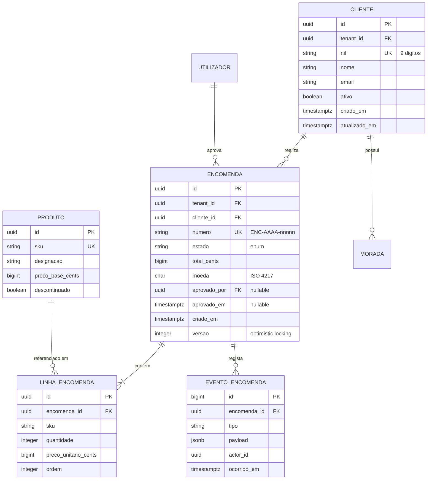

# Modelo de Dados — {{PROJETO}}

**Motor:** {{PostgreSQL 16}} · **Versão do esquema:** {{v{{n}}}} · **Data:** {{AAAA-MM-DD}}

---

## 1. Diagrama Entidade-Relação



---

## 2. Dicionário de dados

### Tabela `encomendas`
| Coluna | Tipo | Nulo | Omissão | Descrição | Regras |
|---|---|---|---|---|---|
| `id` | `uuid` | Não | `gen_random_uuid()` | Chave primária | — |
| `tenant_id` | `uuid` | Não | — | Organização proprietária | RLS ativa |
| `cliente_id` | `uuid` | Não | — | FK → `clientes.id` | `ON DELETE RESTRICT` |
| `numero` | `varchar(16)` | Não | — | Identificador de negócio | Único por tenant; formato `ENC-AAAA-nnnnn` |
| `estado` | `varchar(24)` | Não | `'RASCUNHO'` | Estado do ciclo de vida | CHECK na lista de estados |
| `total_cents` | `bigint` | Não | `0` | Total em cêntimos | ≥ 0; RN-03 |
| `moeda` | `char(3)` | Não | `'EUR'` | ISO 4217 | — |
| `aprovado_por` | `uuid` | Sim | `NULL` | FK → `utilizadores.id` | Obrigatório se estado = APROVADA e total > 500000 |
| `versao` | `integer` | Não | `1` | Bloqueio otimista | Incrementa em cada UPDATE |
| `criado_em` | `timestamptz` | Não | `now()` | UTC | Imutável |
| `atualizado_em` | `timestamptz` | Não | `now()` | UTC | Trigger |

**Índices**
| Nome | Colunas | Tipo | Justificação |
|---|---|---|---|
| `pk_encomendas` | `id` | B-tree único | PK |
| `uq_encomendas_numero` | `tenant_id, numero` | B-tree único | Unicidade de negócio |
| `ix_encomendas_cliente_estado` | `tenant_id, cliente_id, estado` | B-tree | Consulta principal (UC-03) |
| `ix_encomendas_pendentes` | `tenant_id, criado_em` **WHERE** `estado = 'AGUARDA_APROVACAO'` | Parcial | Fila de aprovação; índice pequeno |

**Restrições**
```sql
CHECK (total_cents >= 0)
CHECK (estado IN ('RASCUNHO','SUBMETIDA','AGUARDA_APROVACAO','APROVADA','EM_PREPARACAO','EXPEDIDA','ENTREGUE','CANCELADA','REJEITADA'))
CHECK (estado <> 'APROVADA' OR aprovado_em IS NOT NULL)
```

---

## 3. Classificação de dados (privacidade e segurança)

| Tabela.Coluna | Classificação | Dado pessoal? | Cifra | Retenção | Anonimização em staging |
|---|---|---|---|---|---|
| `clientes.nome` | Confidencial | Sim | Em repouso | {{10 anos após fim de relação}} | Substituir por nome fictício |
| `clientes.nif` | Confidencial | Sim | Em repouso + coluna | {{10 anos (fiscal)}} | Gerar NIF válido fictício |
| `clientes.email` | Confidencial | Sim | Em repouso | {{10 anos}} | `user{{n}}@exemplo.invalid` |
| `encomendas.total_cents` | Interno | Não | — | {{10 anos}} | Manter |
| `eventos_encomenda.payload` | Confidencial | Pode conter | Em repouso | {{2 anos}} | Truncar |

**Classificações:** Público · Interno · Confidencial · Restrito
> Ver [Privacidade / RGPD](../07-governanca/02-privacidade-rgpd.md)

---

## 4. Convenções

| Aspeto | Convenção |
|---|---|
| Nomes de tabelas | `snake_case`, plural (`encomendas`) |
| Nomes de colunas | `snake_case`, singular |
| Chaves primárias | `id` UUID v7 (ordenável) |
| Chaves estrangeiras | `{{tabela_singular}}_id` |
| Booleanos | Prefixo `e_`/`tem_` ou adjetivo (`ativo`) — nunca negativos (`nao_ativo`) |
| Datas/horas | `timestamptz`, sempre UTC; sufixo `_em` |
| Dinheiro | `bigint` em cêntimos + coluna de moeda; **nunca** `float` |
| Enumerações | `varchar` + `CHECK` (mais fácil de evoluir que `ENUM` nativo) |
| Soft delete | `eliminado_em timestamptz NULL` — usar apenas quando necessário |
| Índices | `ix_` normal · `uq_` único · `pk_` primária · `fk_` estrangeira |

---

## 5. Migrações

### Princípios
1. **Forward-only** — nunca editar uma migração já aplicada em produção.
2. **Compatíveis com a versão anterior** do código (deploy contínuo exige que N e N+1 coexistam).
3. **Expand → Migrate → Contract** para alterações destrutivas.
4. Migrações longas correm **fora** do arranque da aplicação.

### Padrão Expand/Contract — exemplo: renomear coluna
| Fase | Ação | Deploy |
|---|---|---|
| 1. Expand | Adicionar `novo_nome`; escrever nos dois | v1.1 |
| 2. Backfill | Copiar dados em lotes | script |
| 3. Migrate | Ler de `novo_nome` | v1.2 |
| 4. Contract | Remover `nome_antigo` | v1.3 |

### Registo
| Versão | Ficheiro | Descrição | Aplicada em prod | Reversível | Duração |
|---|---|---|---|---|---|
| {{V001}} | `V001__esquema_inicial.sql` | Tabelas base | {{data}} | Não | {{2 s}} |
| {{V014}} | `V014__indice_pendentes.sql` | Índice parcial | {{data}} | Sim | {{45 s, CONCURRENTLY}} |

### Checklist antes de uma migração em produção
- [ ] Testada em cópia com volume realista
- [ ] Duração estimada e aceitável (ou aplicada `CONCURRENTLY` / em lotes)
- [ ] Não bloqueia tabelas quentes
- [ ] Compatível com a versão de código atualmente em produção
- [ ] Plano de reversão documentado
- [ ] Backup verificado imediatamente antes

---

## 6. Estratégia de acesso e desempenho

| Consulta principal | Frequência | Índice usado | Alvo |
|---|---|---|---|
| {{Listar encomendas do cliente por estado}} | {{Muito alta}} | `ix_encomendas_cliente_estado` | {{< 20 ms}} |
| {{Fila de aprovação}} | {{Alta}} | `ix_encomendas_pendentes` | {{< 30 ms}} |
| {{Relatório mensal}} | {{Baixa}} | {{Réplica de leitura + agregação}} | {{< 5 s}} |

**Anti-padrões a evitar:** N+1 · `SELECT *` em listagens · paginação por `OFFSET` em tabelas grandes (usar keyset) · consultas analíticas na primária.

---

## 7. Volumetria e crescimento

| Tabela | Registos atuais | Crescimento/mês | Projeção 3 anos | Estratégia |
|---|---|---|---|---|
| `encomendas` | {{50 000}} | {{+3 000}} | {{~160 000}} | Normal |
| `eventos_encomenda` | {{800 000}} | {{+60 000}} | {{~3 M}} | Particionar por mês; arquivar > 2 anos |

---

## 8. Multi-tenancy

| Aspeto | Decisão |
|---|---|
| Modelo | {{Base de dados partilhada, esquema partilhado, coluna `tenant_id`}} |
| Isolamento | {{Row-Level Security do PostgreSQL + `SET app.tenant_id` por sessão}} |
| Risco principal | {{Consulta sem filtro de tenant → fuga entre clientes}} |
| Mitigação | {{RLS obrigatória; teste automático que verifica isolamento em todas as tabelas}} |
