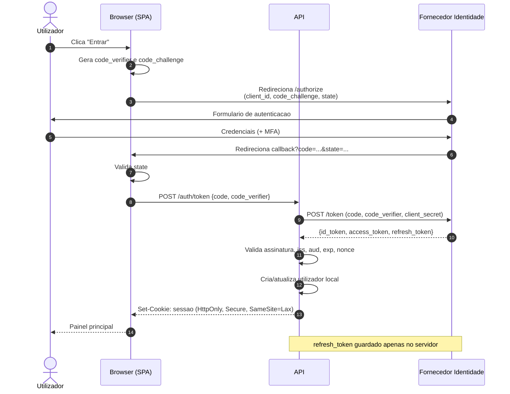
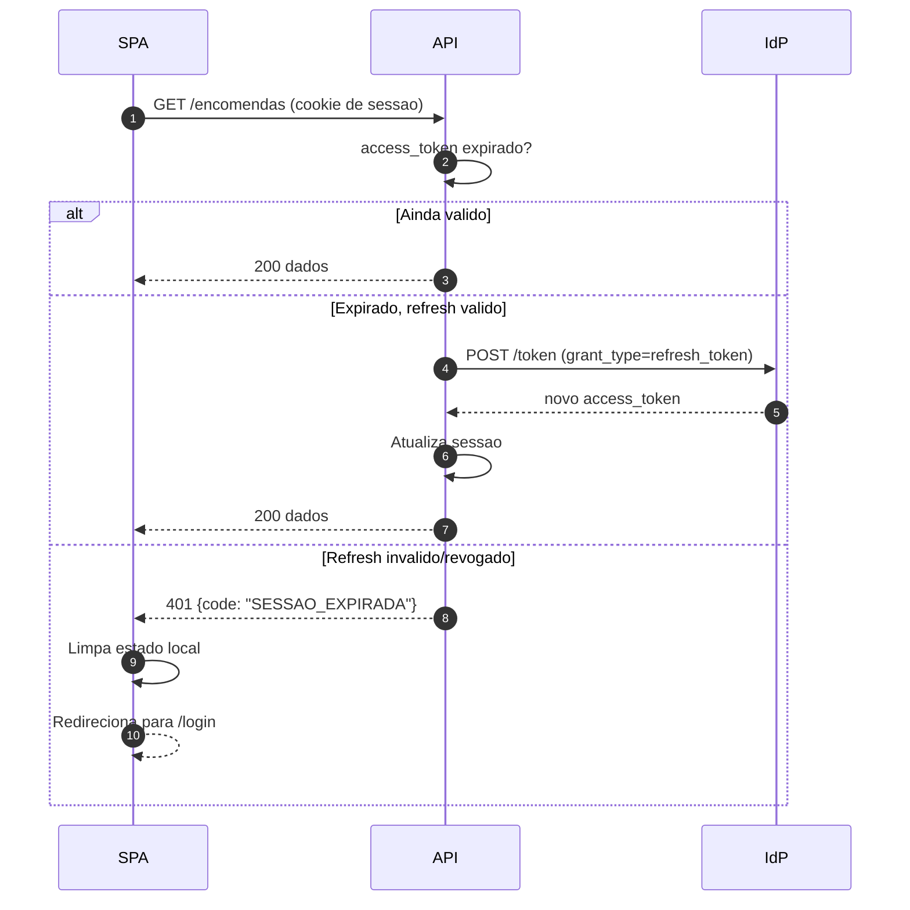
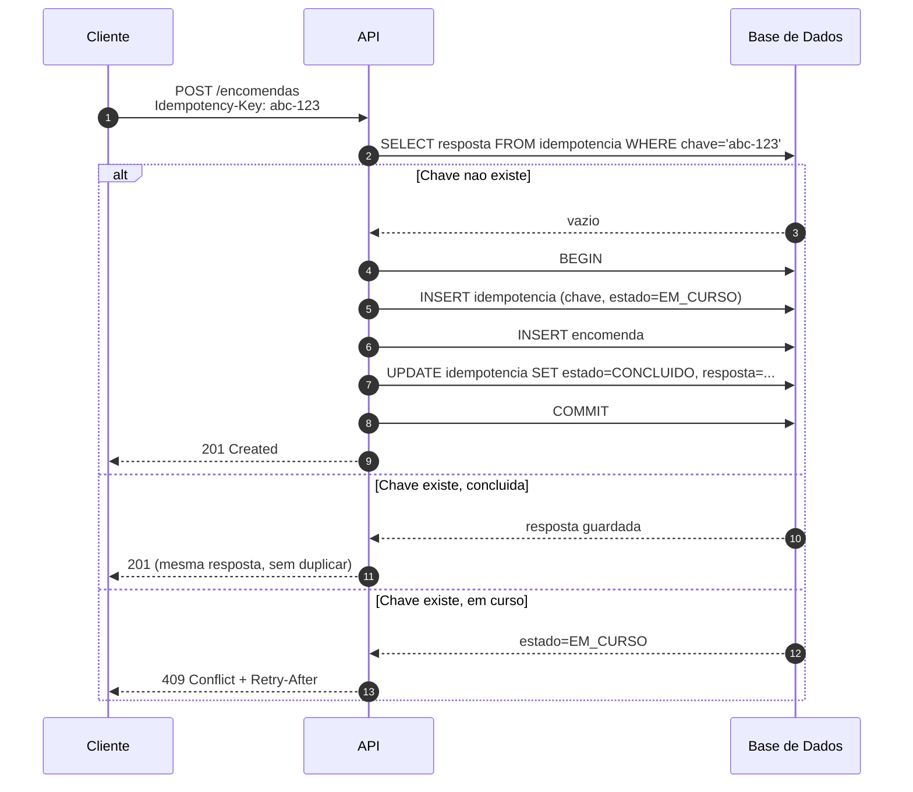
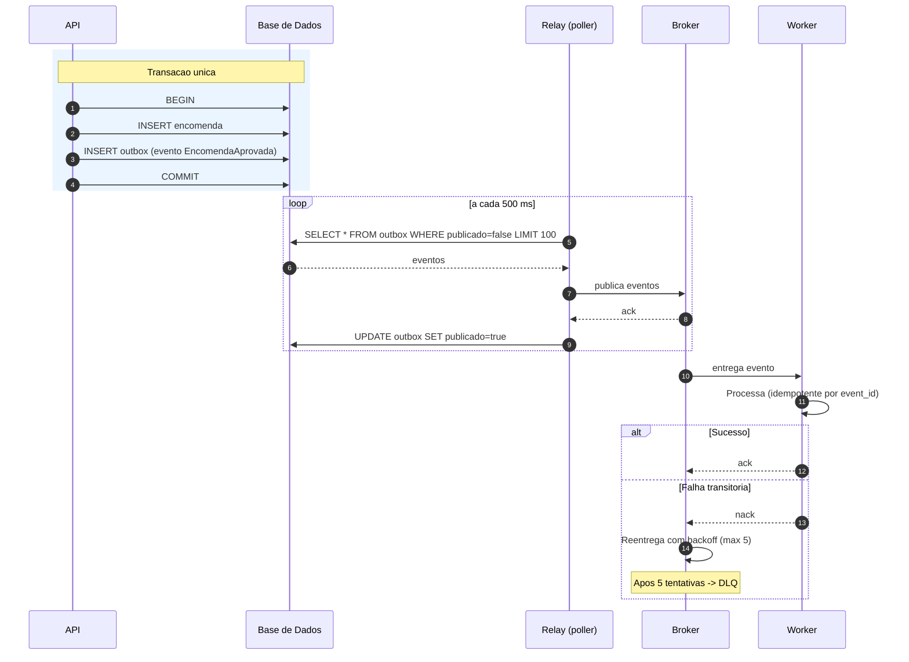
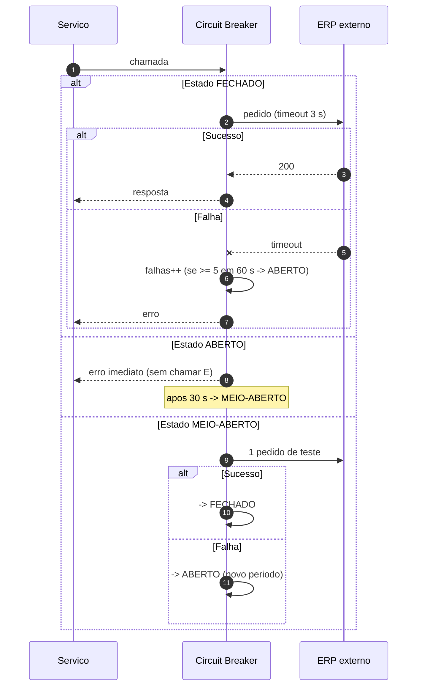
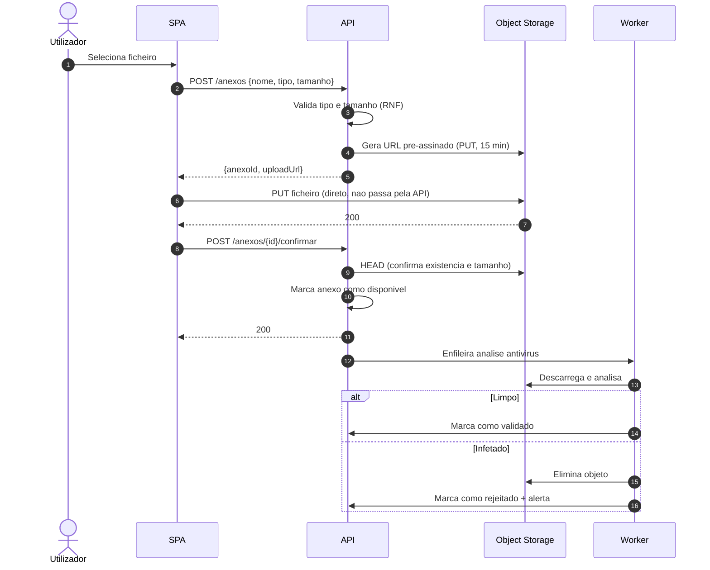

# Diagramas de Sequência — Cenários Técnicos

> Complementa [Fluxos e Processos](../02-analise/03-fluxos-processo.md), que cobre a perspetiva de negócio. Aqui documenta-se a interação **técnica** entre componentes.

---

## 1. Autenticação OIDC (Authorization Code + PKCE)

---

## 2. Renovação de token e sessão expirada

---

## 3. Escrita idempotente

---

## 4. Processamento assíncrono com garantia de entrega (Outbox)

**Porquê Outbox:** evita a escrita dupla (gravar na BD *e* publicar no broker sem transação comum), onde uma falha entre as duas deixa o sistema inconsistente.

---

## 5. Circuit breaker sobre dependência externa

---

## 6. Upload de ficheiro com URL pré-assinado

---

## 7. {{Cenário próprio}}
{{Copiar a estrutura acima}}
