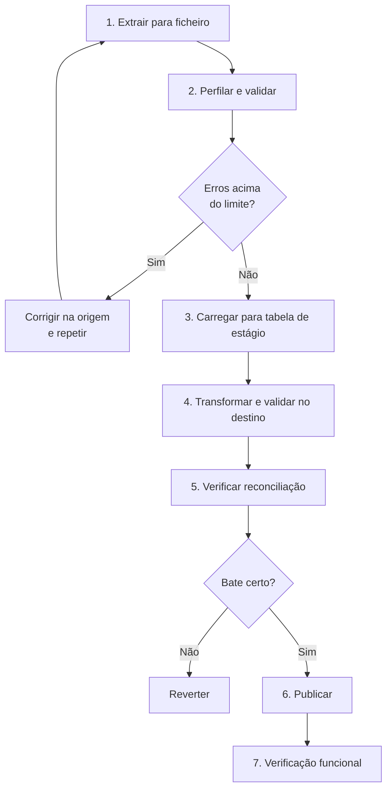

# Plano de Migração de Dados — {{PROJETO}}

> **Estado:** {{rascunho | ensaiado | aprovado | executado}}
> **Data:** {{AAAA-MM-DD}} · **Dono:** {{nome}} · **Aprova:** {{...}}

---

## 1. O que se migra, de onde para onde

| Origem | Destino | Volume | Janela |
|---|---|---|---|
| {{Folhas de cálculo}} | {{`fleet.fleet_vehicle`}} | {{~340 linhas}} | {{...}} |
| {{Sistema {{X}}}} | {{...}} | {{...}} | {{...}} |

**Tipo de migração**

| Tipo | Descrição | Escolhido |
|---|---|---|
| Corte único (*big bang*) | Para o sistema antigo, migra, arranca o novo | {{☐}} |
| Faseada por domínio | Um conjunto de dados de cada vez | {{☐}} |
| Convivência com sincronização | Os dois a correr durante um período | {{☐}} |

---

## 2. Levantamento da origem

**A regra:** olhar para os dados reais antes de escrever uma linha de código de
migração. A documentação da origem descreve o que devia lá estar.

| Verificação | Resultado | Consequência |
|---|---|---|
| Quantas linhas, por tabela | {{...}} | |
| Chaves duplicadas | {{...}} | {{regra de desempate}} |
| Campos obrigatórios em falta | {{...}} | {{valor por omissão ou rejeição}} |
| Formatos inconsistentes (datas, matrículas) | {{...}} | {{normalização}} |
| Codificação de caracteres | {{...}} | {{...}} |
| Referências órfãs | {{...}} | {{criar em falta ou descartar}} |
| Registos de teste em produção | {{...}} | {{critério de exclusão}} |

**Consulta de perfilagem:**
```sql
SELECT COUNT(*) AS total,
       COUNT(DISTINCT {{chave}}) AS distintos,
       COUNT(*) FILTER (WHERE {{campo}} IS NULL) AS nulos,
       MIN({{data}}) AS mais_antigo, MAX({{data}}) AS mais_recente
  FROM {{origem}};
```

---

## 3. Mapeamento campo a campo

| Origem | Destino | Transformação | Se vazio | Se inválido |
|---|---|---|---|---|
| {{`MATRICULA`}} | {{`fleet_vehicle.plate`}} | {{maiúsculas, hífens}} | Rejeita linha | Rejeita e regista |
| {{`MARCA` (texto)}} | {{`brand_id`}} | {{procura em `fleet_brand`; cria se não existir}} | {{NULL}} | {{cria marca nova}} |
| {{`KMS`}} | {{`current_km`}} | {{inteiro}} | {{0}} | {{rejeita}} |
| — | {{`created_at`}} | {{data da migração}} | — | — |

**Campos do destino sem origem:** {{listar e dizer que valor levam}}
**Campos da origem sem destino:** {{listar e confirmar que se perdem de propósito}}

---

## 4. Estratégia de execução



**Porquê tabela de estágio:** carregar direto para as tabelas finais impede
verificar antes de publicar, e transforma qualquer erro numa reversão em vez
de numa correção.

---

## 5. Ensaio — obrigatório

**Nenhuma migração se executa em produção sem ter corrido pelo menos uma vez
sobre uma cópia real.**

| Ensaio | Data | Ambiente | Linhas | Erros | Duração | Resultado |
|---|---|---|---|---|---|---|
| 1 | {{...}} | {{cópia de produção}} | {{...}} | {{...}} | {{...}} | {{...}} |
| 2 | {{...}} | | | | | |

**Critério para avançar:** {{2 ensaios consecutivos sem erros de gravidade 1 e
duração dentro da janela}}.

---

## 6. Reconciliação

Como se prova que a migração está certa — antes de deixar alguém usar o sistema.

| # | Verificação | Origem | Destino | Tolerância |
|---|---|---|---|---|
| 1 | Contagem de registos | {{340}} | {{340}} | 0 |
| 2 | Soma de {{valores}} | {{12 430,50 €}} | {{12 430,50 €}} | 0 |
| 3 | {{Nº de viaturas ativas}} | {{287}} | {{287}} | 0 |
| 4 | Amostra de {{20}} registos, campo a campo | — | — | 0 diferenças |

**As linhas rejeitadas contam.** `origem = destino + rejeitadas` tem de fechar,
e a lista de rejeitadas tem de ser revista por alguém do negócio.

---

## 7. Reversão

| Momento | Como se reverte | Tempo | Perde-se |
|---|---|---|---|
| Antes de publicar | {{Apagar tabelas de estágio}} | {{minutos}} | Nada |
| Depois de publicar, sem uso | {{Restaurar cópia de segurança}} | {{...}} | Nada |
| Depois de haver uso | {{...}} | {{...}} | {{o que foi introduzido entretanto}} |

**Ponto de não retorno:** {{quando}} — a partir daqui corrige-se para a frente,
não se reverte. Decidir isto **antes** e dizer a quem decide.

---

## 8. Janela de execução

| Passo | Início | Duração | Responsável | Ponto de decisão |
|---|---|---|---|---|
| Cópia de segurança | {{22:00}} | {{20 min}} | {{...}} | — |
| Parar o sistema antigo | {{22:20}} | {{5 min}} | {{...}} | — |
| Migrar | {{22:25}} | {{45 min}} | {{...}} | {{Se passar de 23:30 → reverter}} |
| Reconciliar | {{23:10}} | {{20 min}} | {{...}} | **{{Ir/não ir}}** |
| Abrir o sistema novo | {{23:30}} | {{5 min}} | {{...}} | — |
| Verificação funcional | {{23:35}} | {{25 min}} | {{negócio}} | {{Ir/não ir}} |

---

## 9. Depois

- [ ] Origem em modo de leitura, guardada {{N meses}} — não apagada
- [ ] Lista de rejeitados entregue a {{quem}} e tratada
- [ ] Cópia de segurança pré-migração guardada {{N meses}}
- [ ] Contagens comparadas outra vez {{24 h}} depois
- [ ] [Lições aprendidas](../09-encerramento/02-licoes-aprendidas.md) escritas
