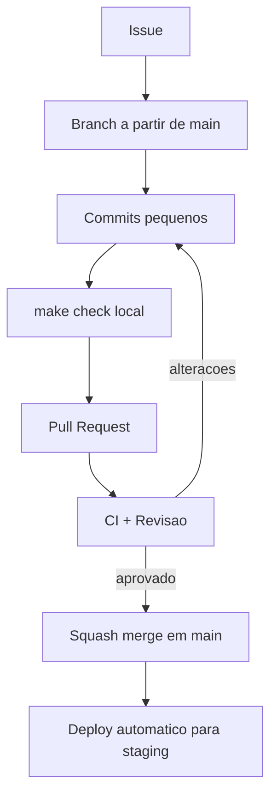

# Guia de Contribuição — {{PROJETO}}

Obrigado por contribuir. Este documento descreve o processo; o [setup do ambiente](01-setup-ambiente.md) descreve as ferramentas.

---

## 1. Fluxo de trabalho



**Modelo de branching:** {{trunk-based — `main` está sempre pronta para produção; branches de vida curta (< 2 dias); funcionalidades incompletas escondidas atrás de feature flags}}

---

## 2. Branches

```
{{tipo}}/{{id-issue}}-{{descricao-curta}}

feat/1234-filtro-encomendas
fix/1250-total-arredondamento
chore/1260-atualizar-dependencias
docs/1270-adr-cache
```

| Tipo | Uso |
|---|---|
| `feat` | Nova funcionalidade |
| `fix` | Correção de bug |
| `refactor` | Alteração interna sem mudar comportamento |
| `perf` | Melhoria de desempenho |
| `test` | Apenas testes |
| `docs` | Apenas documentação |
| `chore` | Dependências, build, configuração |

---

## 3. Mensagens de commit — [Conventional Commits](https://www.conventionalcommits.org/)

```
<tipo>(<âmbito>): <descrição no imperativo, minúscula, sem ponto final>

<corpo: porquê, não o quê — o diff já mostra o quê>

<rodapé: Refs #1234 / BREAKING CHANGE: ...>
```

**Exemplos**
```
feat(encomendas): permitir filtrar por estado e prazo

O gestor não conseguia identificar encomendas em risco sem
percorrer a lista completa. Adiciona filtros combináveis com
persistência na sessão.

Refs #1234
```
```
fix(precos): arredondar no fim de cada operação monetária

O arredondamento intermédio causava divergências de 1 cêntimo
face ao ERP em encomendas com desconto.

Refs #1250
```

**Regras:** descrição ≤ 72 caracteres · imperativo ("adiciona", não "adicionado") · um commit = uma unidade lógica.

---

## 4. Pull Requests

### Antes de abrir
- [ ] `make check` passa localmente
- [ ] Testes cobrem o comportamento novo **e** o caso de erro
- [ ] Documentação atualizada (README, ADR, OpenAPI, esta pasta)
- [ ] Sem segredos, chaves ou dados reais no diff
- [ ] Sem `console.log`, `TODO` sem issue, ou código comentado
- [ ] Migrações compatíveis com a versão anterior do código

### Modelo de descrição
```markdown
## O que muda
{{1-3 linhas}}

## Porquê
{{Problema que resolve. Refs #1234}}

## Como testar
1. {{...}}
2. {{Resultado esperado: ...}}

## Capturas / vídeo
{{Antes e depois, se houver alteração visual}}

## Riscos e mitigação
{{O que pode correr mal em produção; feature flag; plano de rollback}}

## Checklist
- [ ] Testes
- [ ] Documentação
- [ ] Acessibilidade verificada (teclado + contraste)
- [ ] Sem alterações incompatíveis de API (ou documentadas)
```

### Dimensão
Alvo: **< 400 linhas alteradas**. PRs maiores demoram mais a rever e escondem defeitos — divide em: refactor preparatório → funcionalidade → limpeza.

---

## 5. Revisão de código

### Para quem revê
| Nível | Significado | Ação |
|---|---|---|
| **Bloqueante** | Bug, falha de segurança, quebra de contrato | Pedir alteração |
| **Deveria** | Melhoria clara e relevante | Sugerir; autor decide justificando |
| **Nota** (`nit:`) | Preferência de estilo | Nunca bloqueia |

**Boas práticas**
- Comenta o código, nunca a pessoa: "esta função tem 3 responsabilidades", não "escreveste mal".
- Explica o porquê e sugere alternativa concreta.
- Aprova quando está *bom o suficiente*, não quando está como tu farias.
- Prazo alvo: primeira resposta em **{{24 h úteis}}**.

**O que verificar**
- [ ] Resolve o problema declarado, sem âmbito extra
- [ ] Casos limite: vazio, nulo, erro, concorrência, limites numéricos
- [ ] Segurança: entrada validada, autorização verificada no servidor, sem injeção
- [ ] Testes verificam comportamento, não implementação
- [ ] Nomes revelam intenção; código legível sem comentários explicativos
- [ ] Sem regressão de desempenho evidente (N+1, consulta sem índice)
- [ ] Erros tratados e observáveis

### Para quem é revisto
- Responde a todos os comentários (mesmo que com "feito").
- Discordar é legítimo — explica o raciocínio; se persistir, decide o {{tech lead}}.
- Não faças force-push depois de a revisão começar (dificulta ver o que mudou); usa novos commits e faz squash no merge.

---

## 6. Testes exigidos

| Tipo de alteração | Testes obrigatórios |
|---|---|
| Regra de negócio | Unitários com casos limite |
| Endpoint de API | Integração + contrato |
| Interface | Componente + acessibilidade |
| Correção de bug | **Teste que falha antes da correção** |
| Migração | Aplicação e reversão em cópia com dados |

> Ver [Plano de Testes](../05-qualidade/01-plano-testes.md)

---

## 7. Merge e release

| Aspeto | Regra |
|---|---|
| Estratégia | Squash merge; a mensagem do squash segue Conventional Commits |
| Requisitos | {{1 aprovação}} + CI verde + sem conflitos |
| Quem faz merge | O autor, após aprovação |
| Versionamento | [SemVer](https://semver.org/lang/pt-BR/) — `MAJOR.MINOR.PATCH` |
| Changelog | Gerado a partir dos commits; ver [CHANGELOG](../08-utilizador/03-changelog.md) |

---

## 8. Reportar bugs

```markdown
**Descrição:** {{o que acontece}}
**Passos para reproduzir:** 1. … 2. … 3. …
**Resultado esperado:** {{...}}
**Resultado obtido:** {{...}}
**Ambiente:** {{versão, browser/SO, ambiente}}
**Gravidade:** Crítica / Alta / Média / Baixa
**Evidência:** {{capturas, logs, trace_id}}
```

**Vulnerabilidades de segurança:** **não** abrir issue pública — ver [SECURITY](../07-governanca/01-security.md).

---

## 9. Código de conduta
{{Ligar ao CODE_OF_CONDUCT.md. Resumo: respeito, boa-fé, foco no problema.}}
