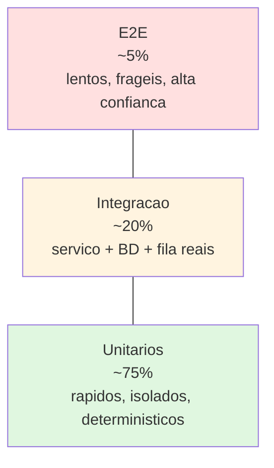
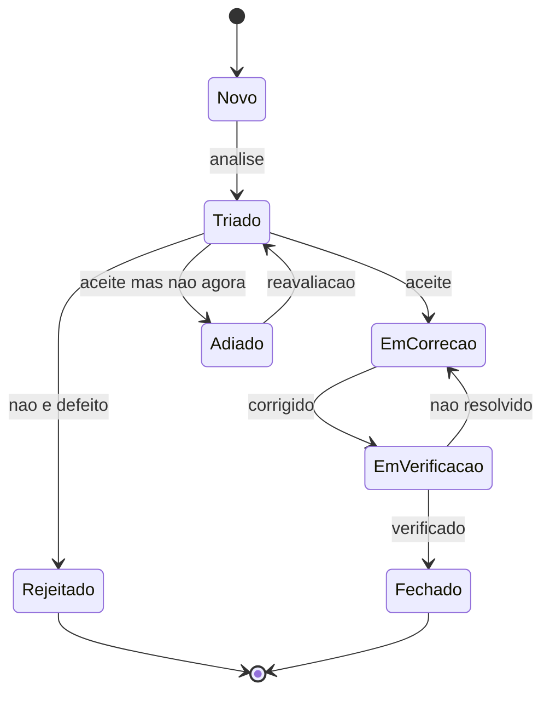

# Plano de Testes — {{PROJETO}}

| Campo | Valor |
|---|---|
| Versão | {{0.1}} |
| Responsável de qualidade | {{Nome}} |
| Data | {{AAAA-MM-DD}} |
| Âmbito | {{Versão 1.0}} |

---

## 1. Objetivos e critérios

### 1.1 Objetivos
{{O que este plano pretende garantir e que risco cobre.}}

### 1.2 Critérios de entrada (pode começar a testar quando…)
- [ ] Funcionalidade implementada e implantada em {{staging}}
- [ ] Testes unitários a passar no CI
- [ ] Dados de teste disponíveis
- [ ] Critérios de aceitação escritos

### 1.3 Critérios de saída (pode lançar quando…)
- [ ] 100% dos casos de teste **Críticos** e **Altos** executados
- [ ] 0 defeitos Críticos ou Altos por resolver
- [ ] ≤ {{3}} defeitos Médios conhecidos, documentados e aceites
- [ ] Cobertura de código ≥ {{80%}} no domínio
- [ ] Testes de desempenho dentro de RNF-01
- [ ] Auditoria de acessibilidade sem falhas de nível A ou AA
- [ ] Análise de segurança sem vulnerabilidades Críticas/Altas

### 1.4 Critérios de suspensão
Suspender os testes se: {{ambiente indisponível > 4 h; defeito bloqueante que impede > 30% dos casos}}.

---

## 2. Pirâmide de testes



| Nível | O que testa | Alvo de tempo | Ferramenta | Quando corre |
|---|---|---|---|---|
| Unitário | Regras de negócio, funções puras | < 10 ms cada; suite < 60 s | {{...}} | Cada commit |
| Integração | Serviço + BD + fila reais (containers) | < 5 min | {{...}} | Cada PR |
| Contrato | Compatibilidade entre API e consumidores | < 1 min | {{Pact}} | Cada PR |
| E2E | Percursos críticos completos | < 15 min | {{Playwright}} | Antes do merge + noturno |
| Carga | RNF de desempenho | {{30 min}} | {{k6}} | Semanal + antes de release |
| Segurança | SAST, SCA, DAST | — | {{...}} | Cada PR / noturno |
| Acessibilidade | WCAG 2.2 AA | — | {{axe}} + manual | Cada PR / por release |
| Exploratório | O que os scripts não antecipam | {{2 h por release}} | Humano | Por release |

---

## 3. Âmbito

### 3.1 A testar
| Área | Prioridade | Justificação |
|---|---|---|
| {{Criação e aprovação de encomendas}} | Crítica | {{Fluxo de receita}} |
| {{Autenticação e permissões}} | Crítica | {{Segurança}} |
| {{Cálculo de preços}} | Crítica | {{Impacto financeiro}} |
| {{Relatórios}} | Média | {{Erro tolerável, corrigível}} |

### 3.2 Não a testar (e porquê)
| Área | Motivo | Risco aceite |
|---|---|---|
| {{Interface do fornecedor de pagamento}} | Sistema de terceiros certificado | {{Baixo}} |

---

## 4. Abordagem baseada em risco

| Funcionalidade | Probabilidade de falha | Impacto | Risco | Intensidade de teste |
|---|---|---|---|---|
| {{Cálculo de preços}} | Média | Alto | **Alto** | Unitários exaustivos + property-based + revisão dupla |
| {{Aprovação}} | Baixa | Alto | Médio | Unitários + E2E |
| {{Exportação CSV}} | Média | Baixo | Baixo | Um caso feliz + um de erro |

---

## 5. Ambientes e dados

| Ambiente | Finalidade | Dados | Reposição |
|---|---|---|---|
| Local | Desenvolvimento | Sintéticos (`make seed`) | A pedido |
| CI | Automáticos | Gerados por teste | Cada execução |
| Staging | Aceitação, E2E, carga | Anonimizados de produção | {{Semanal}} |
| Produção | Testes de fumo pós-deploy | Reais | — |

**Regra de ouro:** nunca dados pessoais reais em ambientes de teste. A anonimização é irreversível e verificada. Ver [Privacidade](../07-governanca/02-privacidade-rgpd.md).

---

## 6. Gestão de defeitos

### Gravidade
| Nível | Definição | Prazo de resolução |
|---|---|---|
| **Crítica** | Sistema inutilizável, perda de dados, falha de segurança | {{Imediato — bloqueia release}} |
| **Alta** | Funcionalidade principal inutilizável, sem alternativa | {{≤ 2 dias — bloqueia release}} |
| **Média** | Funcionalidade degradada com alternativa | {{≤ 2 semanas}} |
| **Baixa** | Cosmético, irritante | {{Backlog}} |

### Ciclo de vida


### Modelo de registo
```markdown
**ID:** BUG-{{nnn}} · **Gravidade:** {{Alta}} · **Ambiente:** {{staging v1.4.2}}
**Requisito afetado:** {{RF-07}} · **Caso de teste:** {{TC-012}}

**Passos:** 1. … 2. … 3. …
**Esperado:** {{...}}
**Obtido:** {{...}}
**Frequência:** Sempre / Intermitente ({{3 em 10}})
**Evidência:** {{captura, log, trace_id}}
**Alternativa temporária:** {{...}}
```

---

## 7. Automação

| Métrica | Atual | Meta |
|---|---|---|
| Casos críticos automatizados | {{60%}} | {{95%}} |
| Duração da suite no CI | {{8 min}} | {{≤ 10 min}} |
| Testes instáveis (flaky) | {{4}} | 0 |

**Política de testes instáveis:** um teste instável é um defeito. Marcar, abrir issue, corrigir em ≤ {{1 sprint}}; se não for corrigido, remover — um teste em que não se confia é pior que nenhum.

---

## 8. Testes não funcionais

### 8.1 Carga
| Cenário | Perfil | Duração | Critério |
|---|---|---|---|
| Carga normal | {{100 utilizadores, 50 rps}} | 30 min | p95 ≤ 300 ms; erros < 0,1% |
| Pico | {{500 utilizadores, 250 rps}} | 10 min | p95 ≤ 800 ms; erros < 1% |
| Resistência (soak) | {{100 utilizadores}} | 8 h | Sem fuga de memória; latência estável |
| Rutura (stress) | Crescente até falhar | — | Identificar ponto de rutura e degradar sem corromper dados |

### 8.2 Segurança
- [ ] SAST no CI · [ ] SCA de dependências · [ ] DAST em staging
- [ ] Teste de autorização: cada endpoint com token de outro tenant → 403/404
- [ ] Teste de isolamento multi-tenant em todas as tabelas
- [ ] {{Pentest externo antes do GA}}

### 8.3 Acessibilidade
- [ ] Automático (axe) sem violações
- [ ] Navegação completa por teclado, foco visível, ordem lógica
- [ ] Leitor de ecrã ({{NVDA/VoiceOver}}) nos percursos críticos
- [ ] Contraste ≥ 4,5:1 · Zoom 200% sem perda de conteúdo
- [ ] Formulários com etiquetas e erros associados programaticamente

### 8.4 Recuperação
- [ ] Restauro de backup testado ({{trimestral}})
- [ ] Falha de uma zona de disponibilidade
- [ ] Dependência externa em baixo → modo degradado conforme especificado

---

## 9. Papéis

| Papel | Responsabilidade |
|---|---|
| {{Programador}} | Testes unitários, de integração e de contrato; corrigir defeitos |
| {{QA}} | Plano, casos, exploratório, coordenação de UAT |
| {{PO}} | Aceitação dos critérios; decisão sobre defeitos Médios |
| {{SRE}} | Carga, caos, recuperação |

---

## 10. Riscos do próprio processo de teste

| Risco | Mitigação |
|---|---|
| {{Staging diverge de produção}} | {{Mesma IaC; comparação de configuração automática}} |
| {{Dados de teste não representativos}} | {{Anonimização a partir de produção, mensal}} |
| {{Tempo de teste comprimido no fim}} | {{Testar continuamente; critérios de saída inegociáveis}} |
