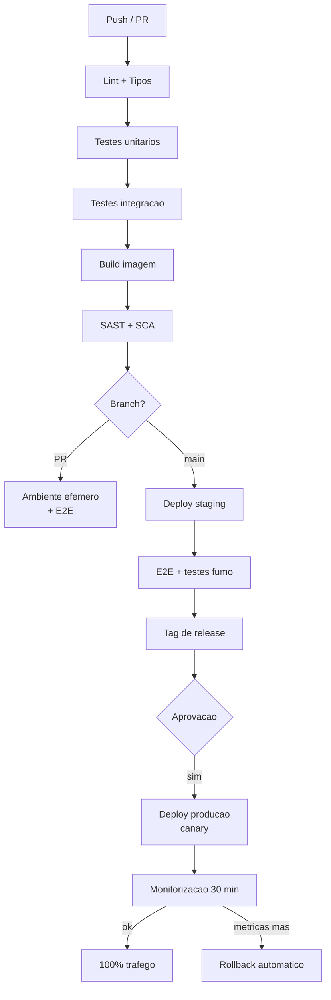

# Guia de Implantação (Deployment) — {{PROJETO}}

---

## 1. Ambientes

| Ambiente | URL | Deploy | Aprovação | Dados | Acesso |
|---|---|---|---|---|---|
| Desenvolvimento | {{localhost}} | Manual | — | Sintéticos | Programadores |
| CI | efémero | Automático por PR | — | Gerados | Pipeline |
| Staging | {{...}} | Automático de `main` | — | Anonimizados | Equipa + PO |
| Produção | {{...}} | Manual a partir de tag | {{1 aprovação}} | Reais | {{SRE + on-call}} |

---

## 2. Pipeline



**Duração alvo:** {{PR → staging em ≤ 15 min}}

---

## 3. Estratégia de implantação

| Aspeto | Decisão |
|---|---|
| Estratégia | {{Canary: 5% → 25% → 100%}} |
| Sem indisponibilidade | Sim — {{rolling update com readiness probes}} |
| Duração de cada fase | {{5% durante 30 min; 25% durante 30 min}} |
| Critério de avanço | {{Taxa de erro < 0,5% e p95 dentro do normal}} |
| Rollback automático | {{Sim — se taxa de erro > 2% durante 5 min}} |
| Migrações de BD | Aplicadas **antes** do deploy, sempre compatíveis com a versão anterior |
| Feature flags | Funcionalidades novas desligadas por omissão; ativação independente do deploy |

---

## 4. Procedimento de release

### 4.1 Antes
- [ ] Todos os testes verdes em `main`
- [ ] Critérios de saída do [Plano de Testes](../05-qualidade/01-plano-testes.md) cumpridos
- [ ] [CHANGELOG](../08-utilizador/03-changelog.md) atualizado
- [ ] Migrações revistas e testadas em cópia com volume realista
- [ ] Backup recente verificado
- [ ] Feature flags configuradas
- [ ] Documentação e notas de versão prontas
- [ ] Equipa de on-call informada; janela adequada (**não** à sexta-feira à tarde)
- [ ] Plano de rollback confirmado

### 4.2 Execução
```bash
# 1. Criar tag
git tag -a v{{1.5.0}} -m "Release {{1.5.0}}"
git push origin v{{1.5.0}}

# 2. Migrações (se aplicável)
{{comando}}

# 3. Deploy
{{comando}}

# 4. Verificar
{{comando de smoke test}}
```

### 4.3 Verificação pós-deploy (primeiros 30 min)
- [ ] Endpoint de saúde responde 200
- [ ] Testes de fumo passam em produção
- [ ] Taxa de erro dentro do normal
- [ ] Latência p95 dentro do normal
- [ ] Sem picos de erros nos logs
- [ ] Fila de mensagens a ser consumida (sem acumulação)
- [ ] Percurso crítico verificado manualmente
- [ ] Métricas de negócio normais ({{encomendas/hora}})

### 4.4 Depois
- [ ] Comunicar em {{canal}}
- [ ] Atualizar o quadro de tarefas
- [ ] Notas de versão publicadas
- [ ] Monitorização reforçada durante {{24 h}}

---

## 5. Rollback

### Quando reverter
- Taxa de erro > {{2%}}
- Latência p95 > {{2×}} o normal
- Perda ou corrupção de dados (**imediato**)
- Funcionalidade crítica indisponível

> **Reverter primeiro, investigar depois.** Restabelecer o serviço tem prioridade sobre entender a causa.

### Como
```bash
# Opção 1 (preferida): desligar a feature flag — segundos, sem deploy
{{comando}}

# Opção 2: reverter para a versão anterior
{{comando}}

# Opção 3: reverter migração de BD (último recurso)
{{comando}}
```

**Tempo alvo de rollback:** {{≤ 5 min}}

### Migrações não reversíveis
| Situação | Estratégia |
|---|---|
| Coluna removida | Nunca remover no mesmo release — usar Expand/Contract |
| Dados transformados | Manter cópia original durante {{7 dias}} |
| Tipo alterado | Nova coluna + escrita dupla; só remover a antiga um release depois |

---

## 6. Configuração e segredos

| Aspeto | Regra |
|---|---|
| Configuração | Variáveis de ambiente; **nunca** no código |
| Segredos | {{Cofre X}}; injetados em execução; nunca em imagens nem em logs |
| Rotação | {{90 dias}} para credenciais de serviço |
| Alterações de configuração | Versionadas, revistas em PR, auditáveis |
| Feature flags | {{Serviço X}}; cada flag com dono e data de remoção |

**Dívida de flags:** uma flag permanente é dívida técnica. Remover ≤ {{2 releases}} após 100%.

---

## 7. Infraestrutura como código

| Aspeto | Valor |
|---|---|
| Ferramenta | {{Terraform / Pulumi}} |
| Repositório | {{...}} |
| Estado | {{backend remoto com bloqueio}} |
| Aplicação | {{Via pipeline; `apply` manual proibido em produção}} |
| Deriva (drift) | {{Verificação diária; alerta se detetada}} |

---

## 8. Calendário e restrições

| Restrição | Regra |
|---|---|
| Janela normal | {{Terça a quinta, 10:00–16:00}} |
| Congelamento | {{Última semana do ano fiscal; {{épocas de pico}}}} |
| Correções urgentes | Permitidas a qualquer momento com aprovação de {{...}} |
| Frequência alvo | {{Diária para staging; várias por semana para produção}} |
