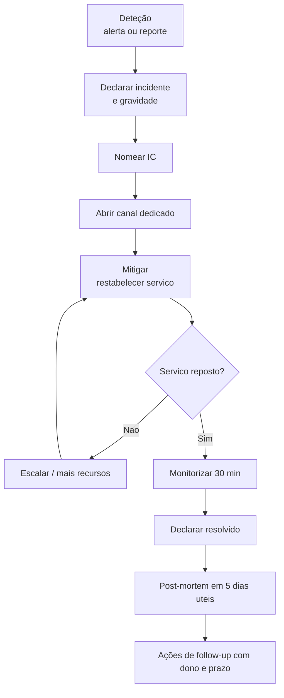

# Gestão de Incidentes e Post-Mortem

---

## Parte 1 — Durante o incidente

### 1.1 Níveis de gravidade

| Nível | Definição | Exemplos | Resposta | Comunicação |
|---|---|---|---|---|
| **P1** | Serviço indisponível ou perda/corrupção de dados | Sistema em baixo; dados de clientes expostos | Imediata, 24/7 | Cliente + gestão em ≤ 30 min |
| **P2** | Funcionalidade principal degradada, sem alternativa | Não é possível criar encomendas | ≤ 30 min, horário alargado | Estado público em ≤ 1 h |
| **P3** | Funcionalidade secundária afetada, com alternativa | Relatórios lentos | Próximo dia útil | Interna |
| **P4** | Impacto mínimo | Erro cosmético | Backlog | Nenhuma |

### 1.2 Papéis

| Papel | Responsabilidade | **Não** faz |
|---|---|---|
| **Comandante do Incidente (IC)** | Coordena, decide, mantém a visão global | Não põe as mãos no teclado |
| **Operações** | Investiga e aplica correções | Não comunica externamente |
| **Comunicações** | Atualiza stakeholders e página de estado | Não investiga |
| **Escriba** | Regista cronologia com horas | Não decide |

> Em incidentes pequenos, uma pessoa pode acumular papéis — mas o papel de IC deve ser **declarado explicitamente**: "Eu sou o IC deste incidente."

### 1.3 Fluxo



### 1.4 Prioridades durante o incidente

1. **Parar a hemorragia** — restabelecer o serviço. Rollback, feature flag, escalar. A causa raiz vem depois.
2. **Preservar evidência** — antes de reiniciar, capturar logs, métricas, *dumps*. Um reinício apaga o rasto.
3. **Comunicar cedo e com frequência** — atualizações a cada {{30 min}} mesmo que sejam "ainda a investigar".
4. **Não culpar** — durante o incidente só importa o próximo passo.

### 1.5 Modelos de comunicação

**Inicial**
```
🔴 INCIDENTE {{P1}} — {{título curto}}
Início: {{HH:MM}} · IC: {{nome}}
Impacto: {{o que os utilizadores não conseguem fazer}}
Estado: A investigar
Próxima atualização: {{HH:MM}}
Canal: {{#inc-...}}
```

**Atualização**
```
🟠 ATUALIZAÇÃO {{HH:MM}} — {{título}}
Estado: {{Mitigado / A investigar / Em correção}}
O que sabemos: {{...}}
O que estamos a fazer: {{...}}
Impacto atual: {{...}}
Próxima atualização: {{HH:MM}}
```

**Resolução**
```
🟢 RESOLVIDO {{HH:MM}} — {{título}}
Duração: {{2h14}} · Impacto: {{~1200 utilizadores; 340 encomendas atrasadas}}
Causa imediata: {{...}}
Correção aplicada: {{...}}
Post-mortem: até {{data}}
```

**Externa (página de estado)** — sem jargão, sem culpar terceiros, com o que o cliente deve fazer:
```
{{Data HH:MM}} — Estamos a investigar problemas na criação de encomendas.
Alguns utilizadores podem receber erros. Estamos a trabalhar na resolução.
Próxima atualização em 30 minutos.
```

---

## Parte 2 — Post-Mortem

> **Sem culpados (blameless).** As pessoas agiram racionalmente com a informação e as ferramentas que tinham. Se alguém "carregou no botão errado", a pergunta é porque é que o sistema permitiu que um botão errado tivesse aquele efeito.

---

# Post-Mortem: {{TÍTULO DO INCIDENTE}}

| Campo | Valor |
|---|---|
| **ID** | INC-{{AAAA}}-{{nnn}} |
| **Data do incidente** | {{AAAA-MM-DD}} |
| **Duração** | {{2h14}} (deteção {{HH:MM}} → resolução {{HH:MM}}) |
| **Gravidade** | {{P1}} |
| **Autores** | {{Nomes}} |
| **Estado** | Rascunho / Revisto / Concluído |
| **Data da revisão** | {{data}} |

## 1. Resumo
{{3-5 linhas legíveis por quem não é da equipa: o que aconteceu, quem foi afetado, o que se fez.}}

## 2. Impacto

| Dimensão | Medida |
|---|---|
| Utilizadores afetados | {{~1200 (30% da base ativa)}} |
| Duração do impacto | {{1h47 de indisponibilidade total}} |
| Operações falhadas | {{340 encomendas}} |
| Impacto financeiro estimado | {{~X €}} |
| Dados perdidos ou corrompidos | {{Nenhum / descrever}} |
| Incumprimento de SLA | {{Sim — 0,4% do orçamento mensal de erro consumido}} |
| Contactos de suporte gerados | {{47}} |

## 3. Cronologia (hora local {{TZ}})

| Hora | Evento | Fonte |
|---|---|---|
| {{14:02}} | Deploy da versão {{1.4.3}} | Pipeline |
| {{14:07}} | Primeiros erros 500 nos logs (não alertaram) | Logs |
| {{14:19}} | Primeiro cliente reporta ao suporte | Ticket #{{...}} |
| {{14:23}} | Alerta `ALTA_TAXA_ERRO_5XX` dispara | Alertas |
| {{14:25}} | Incidente declarado P1; {{Nome}} assume IC | Canal |
| {{14:31}} | Correlação com o deploy identificada | Investigação |
| {{14:38}} | Rollback iniciado | Pipeline |
| {{14:49}} | Rollback concluído; taxa de erro normaliza | Métricas |
| {{15:19}} | Monitorização estável; incidente resolvido | — |
| {{16:16}} | Fila de encomendas atrasadas totalmente processada | — |

**Métricas de resposta**
| Métrica | Valor | Alvo |
|---|---|---|
| Tempo até deteção (TTD) | {{21 min}} | {{≤ 5 min}} |
| Tempo até reconhecimento (TTA) | {{2 min}} | {{≤ 5 min}} |
| Tempo até mitigação (TTM) | {{47 min}} | {{≤ 30 min}} |
| Tempo total até resolução (TTR) | {{2h14}} | — |

## 4. Causa raiz

### O que correu mal
{{Descrição técnica precisa.}}

### Análise dos "porquês"
| # | Pergunta | Resposta |
|---|---|---|
| 1 | Porque é que os pedidos falharam? | {{A aplicação esgotou o pool de ligações à BD}} |
| 2 | Porque é que o pool esgotou? | {{Uma consulta nova não usava índice e demorava 8 s}} |
| 3 | Porque é que a consulta não tinha índice? | {{A migração que o criava não foi incluída no release}} |
| 4 | Porque é que não foi incluída? | {{Estava numa branch separada; o PR foi dividido em dois}} |
| 5 | Porque é que o sistema permitiu isso? | {{Não há verificação de dependências entre migrações e código}} |

> Os "5 porquês" são uma ferramenta, não um ritual. Muitos incidentes têm **várias** causas contribuintes — lista-as todas em vez de forçar uma cadeia linear.

### Fatores contribuintes
| Fator | Descrição |
|---|---|
| {{Testes de carga não cobrem consultas novas}} | {{...}} |
| {{Alerta só dispara com 2% de erro durante 5 min — demasiado tolerante}} | {{...}} |
| {{Deploy à sexta-feira, com equipa reduzida}} | {{...}} |

### O que correu **bem**
> Documentar isto é tão importante como documentar as falhas — é o que se quer preservar.
- {{O rollback funcionou como esperado, em 11 min}}
- {{O runbook estava correto e foi seguido sem hesitação}}
- {{A comunicação com os clientes foi rápida e clara}}

### O que foi sorte
> Sinal de risco latente ainda por resolver.
- {{O incidente ocorreu fora do pico; ao meio-dia teria afetado 3× mais utilizadores}}

## 5. Deteção
| Pergunta | Resposta |
|---|---|
| Como foi detetado? | {{Alerta automático, 21 min após o início}} |
| Poderia ter sido detetado antes? | {{Sim — os erros começaram aos 5 min}} |
| O que faltou? | {{Alerta sobre a taxa de erro do deploy (canary analysis)}} |

## 6. Ações de correção

> Cada ação tem **dono nomeado**, **prazo** e **issue**. Ações sem dono não acontecem.

| # | Ação | Tipo | Dono | Prazo | Issue | Estado |
|---|---|---|---|---|---|---|
| A1 | {{Verificação no CI: migração referenciada por código novo tem de estar no mesmo release}} | Prevenção | {{Nome}} | {{data}} | #{{...}} | Aberta |
| A2 | {{Alerta de erro a 0,5% em 2 min}} | Deteção | {{Nome}} | {{data}} | #{{...}} | Aberta |
| A3 | {{Análise automática de canary com rollback automático}} | Mitigação | {{Nome}} | {{data}} | #{{...}} | Aberta |
| A4 | {{Adicionar teste de carga às consultas novas}} | Prevenção | {{Nome}} | {{data}} | #{{...}} | Aberta |
| A5 | {{Atualizar runbook com o procedimento de pool esgotado}} | Resposta | {{Nome}} | {{data}} | #{{...}} | Concluída |

**Distribuição desejada:** priorizar **prevenção** e **deteção** sobre "ter mais cuidado". "Vamos ter atenção" não é uma ação.

## 7. Lições aprendidas
- {{...}}

## 8. Perguntas em aberto
| # | Questão | Dono |
|---|---|---|
| Q1 | {{...}} | {{Nome}} |

---

## Registo de incidentes

| ID | Data | Gravidade | Título | Duração | Post-mortem | Ações fechadas |
|---|---|---|---|---|---|---|
| INC-2026-001 | {{data}} | P1 | {{...}} | {{2h14}} | [link] | {{3/5}} |

### Indicadores agregados ({{trimestre}})
| Métrica | Valor | Tendência |
|---|---|---|
| Nº de incidentes P1/P2 | {{3}} | ↓ |
| MTTD médio | {{12 min}} | ↓ |
| MTTR médio | {{1h20}} | ↔ |
| % de ações de post-mortem concluídas no prazo | {{78%}} | ↑ |
| Incidentes com causa repetida | {{1}} | — |
