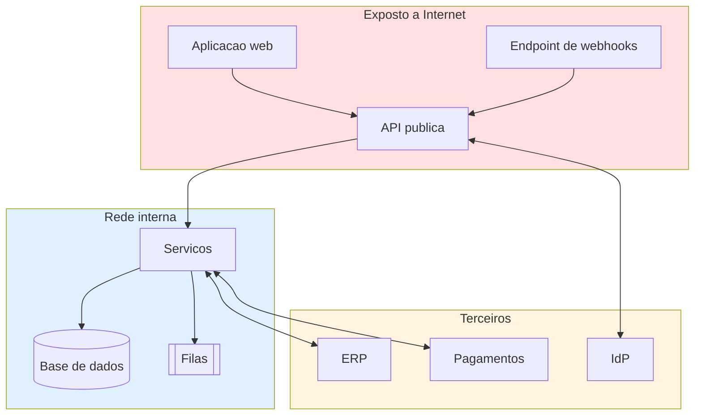

# Política e Documentação de Segurança

> Ficheiro `SECURITY.md` na raiz do repositório deve apontar para aqui (ou conter a secção 1).

---

## 1. Reporte de vulnerabilidades

**Não abras uma issue pública para vulnerabilidades de segurança.**

| Canal | {{security@{{dominio}}}} |
|---|---|
| Chave PGP | {{impressão digital / link}} |
| Resposta inicial | ≤ {{48 h}} |
| Avaliação e plano | ≤ {{7 dias}} |
| Divulgação coordenada | {{90 dias ou após correção}} |

**Ao reportar, inclui:** descrição, passos de reprodução, impacto potencial, versão afetada e prova de conceito se existir.

**Compromisso:** não tomamos ação legal contra investigação de boa-fé que respeite os limites abaixo.
**Fora de âmbito:** {{ataques de negação de serviço, engenharia social, ataques físicos, relatórios automáticos de scanners sem impacto demonstrado}}.

---

## 2. Modelo de ameaças

### 2.1 Ativos a proteger
| Ativo | Classificação | Impacto se comprometido |
|---|---|---|
| {{Dados pessoais de clientes}} | Restrito | {{Notificação à CNPD, coima, perda de confiança}} |
| {{Credenciais de acesso}} | Restrito | {{Acesso total}} |
| {{Dados comerciais (preços, margens)}} | Confidencial | {{Vantagem para a concorrência}} |
| {{Disponibilidade do serviço}} | — | {{Perda de receita}} |

### 2.2 Agentes de ameaça
| Agente | Motivação | Capacidade | Prioridade |
|---|---|---|---|
| Atacante externo oportunista | Ganho financeiro | Baixa (ferramentas automáticas) | Alta |
| Atacante direcionado | {{Espionagem, ransomware}} | Alta | Média |
| Utilizador legítimo malicioso | {{Exfiltrar dados de clientes}} | Média (acesso legítimo) | Alta |
| Erro interno não malicioso | — | — | **Alta** |
| Fornecedor comprometido | — | Variável | Média |

### 2.3 STRIDE

| Ameaça | Descrição | Exemplo neste sistema | Mitigação | RNF |
|---|---|---|---|---|
| **S**poofing | Fazer-se passar por outro | {{Roubo de sessão}} | {{OIDC, cookies HttpOnly+Secure, MFA para admin}} | RNF-13, 17 |
| **T**ampering | Alterar dados | {{Manipular o total no cliente}} | {{Preços calculados no servidor; assinatura de payloads}} | RNF-14 |
| **R**epudiation | Negar ter feito | {{"Não fui eu que aprovei"}} | {{Auditoria imutável com autor e timestamp}} | RNF-15 |
| **I**nformation disclosure | Fuga de informação | {{Aceder a encomendas de outro tenant}} | {{RLS, autorização por objeto, testes de isolamento}} | RNF-14 |
| **D**enial of service | Indisponibilizar | {{Inundação de pedidos}} | {{Rate limiting, WAF, autoscaling}} | RNF-07 |
| **E**levation of privilege | Ganhar permissões | {{Cliente aprova a própria encomenda}} | {{RBAC no servidor; negação por omissão}} | RNF-14 |

### 2.4 Superfície de ataque

| Ponto de entrada | Exposição | Controlos |
|---|---|---|
| API pública | Internet | {{WAF, TLS, autenticação, rate limit, validação de esquema}} |
| Endpoint de webhooks | Internet | {{Verificação de assinatura HMAC + timestamp, lista de IPs}} |
| Upload de ficheiros | Autenticado | {{Tipo e tamanho validados, antivírus, armazenamento isolado, sem execução}} |
| Painel de administração | {{Internet + MFA}} | {{MFA obrigatório, lista de IPs, sessão curta}} |

---

## 3. Controlos implementados

### 3.1 Identidade e acesso
- [ ] Autenticação {{via OIDC}}; palavras-passe com {{Argon2id}}
- [ ] MFA obrigatório para papéis administrativos
- [ ] RBAC com princípio do menor privilégio; negação por omissão
- [ ] Autorização verificada **no servidor**, por objeto (não só por rota)
- [ ] Sessões com expiração; invalidação global no logout e na mudança de palavra-passe
- [ ] Revisão de acessos {{trimestral}}

### 3.2 Dados
- [ ] TLS 1.2+ em trânsito; HSTS com preload
- [ ] Cifra em repouso (BD, backups, object storage)
- [ ] Chaves geridas em {{KMS}}; rotação {{anual}}
- [ ] Dados sensíveis nunca em logs, URLs ou mensagens de erro
- [ ] Anonimização irreversível em ambientes não produtivos

### 3.3 Aplicação
- [ ] Validação de entrada por esquema, na fronteira
- [ ] Consultas parametrizadas (sem concatenação de SQL)
- [ ] Escape contextual na saída
- [ ] Proteção CSRF {{(SameSite + token)}}
- [ ] Cabeçalhos de segurança: `CSP`, `X-Content-Type-Options`, `Referrer-Policy`, `Permissions-Policy`
- [ ] Rate limiting por IP e por conta
- [ ] Dependências analisadas no CI; críticas corrigidas em ≤ {{7}} dias
- [ ] Sem segredos no repositório (verificação automática no CI)

### 3.4 Infraestrutura
- [ ] Segmentação de rede; base de dados sem acesso público
- [ ] Menor privilégio nas identidades de serviço
- [ ] Imagens de base atualizadas e analisadas
- [ ] Containers sem privilégios, sistema de ficheiros só de leitura onde possível
- [ ] Logs de auditoria da infraestrutura ativos e imutáveis

### 3.5 Deteção
- [ ] Alertas de autenticação anómala (força bruta, geografia improvável)
- [ ] Alertas de escalada de privilégios
- [ ] Alertas de exfiltração (volume anómalo de exportações)
- [ ] Auditoria de acesso a dados pessoais

---

## 4. Verificação OWASP Top 10

| # | Risco | Estado | Controlo | Testado por |
|---|---|---|---|---|
| A01 | Quebra de controlo de acesso | {{✓}} | RBAC + testes de isolamento por tenant | TC-{{...}} |
| A02 | Falhas criptográficas | {{✓}} | TLS 1.3, AES-256, Argon2id | Auditoria |
| A03 | Injeção | {{✓}} | Consultas parametrizadas, validação de esquema | SAST |
| A04 | Desenho inseguro | {{✓}} | Modelo de ameaças, revisão de arquitetura | ADRs |
| A05 | Má configuração | {{✓}} | IaC revista, benchmarks CIS | Análise |
| A06 | Componentes vulneráveis | {{✓}} | SCA no CI, atualizações mensais | Pipeline |
| A07 | Falhas de identificação | {{✓}} | MFA, bloqueio, sessões curtas | TC-003 |
| A08 | Falhas de integridade | {{✓}} | Assinatura de artefactos, SBOM | Pipeline |
| A09 | Falhas de registo e monitorização | {{✓}} | Auditoria imutável, alertas | Exercício |
| A10 | SSRF | {{✓}} | Lista branca de destinos, sem redireções seguidas | SAST |

---

## 5. Gestão de vulnerabilidades

| Gravidade (CVSS) | Prazo de correção | Exceção requer |
|---|---|---|
| Crítica (9,0–10) | {{24 h}} | Aprovação do CISO |
| Alta (7,0–8,9) | {{7 dias}} | Aprovação do CISO |
| Média (4,0–6,9) | {{30 dias}} | Registo documentado |
| Baixa (< 4,0) | {{Próximo ciclo}} | — |

**Registo de exceções**
| # | Vulnerabilidade | Gravidade | Motivo da exceção | Compensação | Prazo | Aprovada por |
|---|---|---|---|---|---|---|
| {{...}} | {{CVE-...}} | Alta | {{Sem correção disponível}} | {{WAF bloqueia o vetor}} | {{data}} | {{Nome}} |

---

## 6. Resposta a incidentes de segurança

> Além do [processo geral de incidentes](../06-operacao/03-incidentes-postmortem.md), um incidente de segurança tem obrigações adicionais.

| Fase | Ação | Prazo |
|---|---|---|
| Deteção | Declarar incidente de segurança; nomear IC | Imediato |
| Contenção | Isolar sistemas; revogar credenciais; **preservar evidência antes de reiniciar** | ≤ 1 h |
| Avaliação | Determinar dados afetados, número de titulares, risco | ≤ 24 h |
| Notificação | {{CNPD}} se houver risco para os titulares | **≤ 72 h** (RGPD art. 33) |
| Notificação aos titulares | Se risco elevado | Sem demora injustificada (art. 34) |
| Erradicação e recuperação | Corrigir causa; restabelecer em ambiente limpo | — |
| Post-mortem | Sem culpados; com ações | ≤ 5 dias úteis |

**Contactos:** {{CISO}} · {{DPO}} · {{Jurídico}} · {{Seguradora cibernética, apólice n.º}} · {{CNPD}}

---

## 7. Auditorias e certificações

| Atividade | Frequência | Última | Próxima | Relatório |
|---|---|---|---|---|
| Pentest externo | {{Anual}} | {{data}} | {{data}} | {{link}} |
| Revisão de acessos | {{Trimestral}} | {{data}} | {{data}} | |
| Revisão do modelo de ameaças | {{Anual ou por mudança arquitetural}} | {{data}} | {{data}} | |
| {{Certificação ISO 27001 / SOC 2}} | {{Anual}} | {{data}} | {{data}} | |
