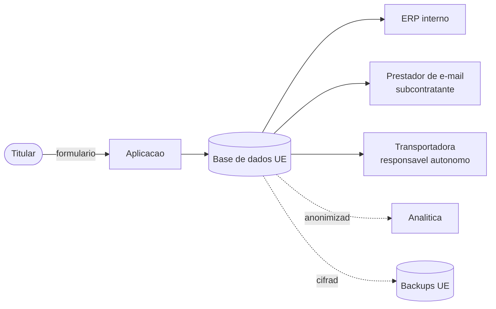
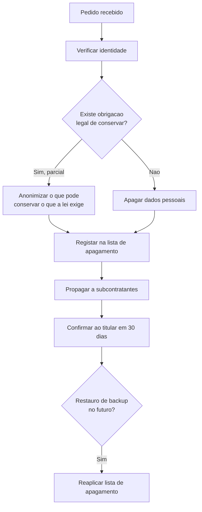

# Privacidade e Conformidade com o RGPD

> Este documento apoia a conformidade; **não substitui aconselhamento jurídico**. Valida com o {{DPO / jurídico}} antes de tratar dados pessoais reais.

| Campo | Valor |
|---|---|
| Responsável pelo tratamento | {{Entidade, NIF, morada}} |
| Encarregado de Proteção de Dados (DPO) | {{Nome, contacto}} |
| Última revisão | {{AAAA-MM-DD}} |

---

## 1. Registo de atividades de tratamento (art. 30)

### Atividade: {{Gestão de encomendas}}

| Campo | Valor |
|---|---|
| **Finalidade** | {{Executar e acompanhar encomendas de clientes}} |
| **Fundamento de licitude** | {{Execução de contrato (art. 6.º/1/b)}} |
| **Categorias de titulares** | {{Clientes, contactos de clientes empresariais}} |
| **Categorias de dados** | {{Nome, e-mail, telefone, NIF, morada de entrega, histórico de encomendas}} |
| **Categorias especiais (art. 9)** | {{Nenhuma}} |
| **Destinatários** | {{Transportadora, ERP interno, prestador de e-mail}} |
| **Transferências para países terceiros** | {{Nenhuma / {{país}} ao abrigo de {{cláusulas-tipo}}}} |
| **Prazo de conservação** | {{10 anos após a última encomenda (obrigação fiscal)}} |
| **Medidas de segurança** | {{Cifra em repouso e em trânsito, controlo de acessos, auditoria}} |

### Atividade: {{Marketing por e-mail}}
| **Fundamento** | {{Consentimento (art. 6.º/1/a)}} · **Conservação:** {{até retirada do consentimento}} |

---

## 2. Inventário de dados pessoais

| Sistema / Tabela | Campo | Categoria | Fundamento | Conservação | Cifrado | Anonimizável |
|---|---|---|---|---|---|---|
| `clientes.nome` | Nome | Identificação | Contrato | {{10 anos}} | Sim | Sim |
| `clientes.email` | E-mail | Contacto | Contrato | {{10 anos}} | Sim | Sim |
| `clientes.nif` | NIF | Identificação fiscal | Obrigação legal | {{10 anos}} | Sim | Sim (gerar fictício) |
| `utilizadores.ip_ultimo_acesso` | IP | Técnico | Interesse legítimo (segurança) | {{90 dias}} | Não | Truncar |
| `logs_auditoria.actor_id` | Pseudónimo | Técnico | Obrigação legal | {{7 anos}} | — | Já pseudonimizado |

**Fluxo de dados pessoais**

---

## 3. Princípios (art. 5) — como são cumpridos

| Princípio | Como é cumprido neste sistema |
|---|---|
| **Licitude, lealdade e transparência** | {{Política de privacidade acessível; informação no momento da recolha}} |
| **Limitação das finalidades** | {{Dados de encomendas não usados para marketing sem consentimento separado}} |
| **Minimização** | {{Só se recolhe o necessário; data de nascimento não é pedida}} |
| **Exatidão** | {{O titular pode corrigir os seus dados no perfil}} |
| **Limitação da conservação** | {{Eliminação automática conforme §2}} |
| **Integridade e confidencialidade** | {{Ver [SECURITY](01-security.md)}} |
| **Responsabilidade** | {{Este registo, DPIA, auditorias}} |

---

## 4. Direitos dos titulares

| Direito | Artigo | Como é exercido | Prazo | Implementado |
|---|---|---|---|---|
| Informação | 13-14 | Política de privacidade + aviso na recolha | — | {{✓}} |
| Acesso | 15 | {{Autosserviço no perfil + pedido a {{email}}}} | 30 dias | {{✓}} |
| Retificação | 16 | {{Edição no perfil}} | 30 dias | {{✓}} |
| Apagamento | 17 | {{Pedido a {{email}} → processo §5}} | 30 dias | {{✓}} |
| Limitação | 18 | {{Flag `tratamento_limitado` na conta}} | 30 dias | {{...}} |
| Portabilidade | 20 | {{Exportação JSON/CSV no perfil}} | 30 dias | {{✓}} |
| Oposição | 21 | {{Cancelar subscrição; opor-se ao perfilamento}} | 30 dias | {{✓}} |
| Decisões automatizadas | 22 | {{Não aplicável / revisão humana disponível}} | — | — |

### Registo de pedidos
| # | Data | Titular | Direito | Prazo | Concluído | Resultado |
|---|---|---|---|---|---|---|
| {{...}} | {{data}} | {{ref}} | Acesso | {{data}} | {{data}} | Fornecido |

---

## 5. Procedimento de apagamento

**Sistemas a abranger:** {{base de dados principal, ERP, prestador de e-mail, ferramenta de suporte, analítica, backups}}

**Backups:** os dados não são apagados dos backups existentes (tecnicamente inviável e comprometeria a integridade). Abordagem: **os backups expiram naturalmente em {{35 dias}}** e a lista de apagamento é **reaplicada após qualquer restauro**. Documentar esta abordagem é o que torna a prática defensável.

**O que se conserva apesar do pedido**
| Dado | Fundamento | Prazo |
|---|---|---|
| {{Faturas}} | {{Obrigação fiscal — 10 anos}} | {{10 anos}} |
| {{Registo de que houve pedido de apagamento}} | {{Prova de cumprimento}} | {{5 anos}} |

---

## 6. Subcontratantes (art. 28)

| Subcontratante | Finalidade | Dados | Localização | Contrato de subcontratação | Transferência internacional | Última avaliação |
|---|---|---|---|---|---|---|
| {{Cloud X}} | Alojamento | Todos | {{UE — Irlanda}} | {{Assinado {{data}}}} | Não | {{data}} |
| {{Prestador e-mail}} | Notificações | Nome, e-mail | {{UE}} | {{Assinado}} | Não | {{data}} |
| {{Ferramenta de suporte}} | Apoio ao cliente | Nome, e-mail, histórico | {{EUA}} | {{Assinado}} | {{Sim — DPF / cláusulas-tipo}} | {{data}} |

**Requisitos para adicionar um novo subcontratante:** avaliação de segurança · contrato de subcontratação assinado · localização e transferências documentadas · atualização da política de privacidade · notificação aos titulares se relevante.

---

## 7. Avaliação de Impacto (DPIA)

**É obrigatória quando:** tratamento em larga escala de categorias especiais · perfilamento com efeitos jurídicos · monitorização sistemática de zonas públicas · uso de novas tecnologias com risco elevado.

**Necessária neste projeto?** {{Não — justificação: {{...}}}} / {{Sim — ver documento {{link}}}}

### Estrutura da DPIA (se aplicável)
1. Descrição sistemática do tratamento
2. Necessidade e proporcionalidade
3. Riscos para os direitos e liberdades dos titulares
4. Medidas para fazer face aos riscos
5. Parecer do DPO
6. Consulta à autoridade de controlo, se o risco residual for elevado

---

## 8. Consentimento e cookies

| Requisito | Estado |
|---|---|
| Consentimento livre, específico, informado e inequívoco | {{✓}} |
| Ação afirmativa (sem caixas pré-marcadas) | {{✓}} |
| Retirar é tão fácil como dar | {{✓}} |
| Registo de quando, como e a quê se consentiu | {{✓}} |
| Cookies não essenciais só após consentimento | {{✓}} |
| Rejeitar é tão fácil como aceitar (mesmo nível) | {{✓}} |

| Cookie | Finalidade | Essencial | Duração | Consentimento |
|---|---|---|---|---|
| `sessao` | Autenticação | Sim | Sessão | Não necessário |
| `preferencias` | Idioma, tema | Sim | 1 ano | Não necessário |
| {{`analytics`}} | {{Estatísticas}} | Não | {{13 meses}} | Necessário |

---

## 9. Privacidade desde a conceção (art. 25)

| Prática | Aplicação neste sistema |
|---|---|
| Minimização por omissão | {{Campos opcionais são realmente opcionais; não se pede o que não se usa}} |
| Pseudonimização | {{`user_id` nos logs em vez de e-mail}} |
| Definições mais protetoras por omissão | {{Marketing desligado por omissão}} |
| Retenção como código | {{Job de eliminação automática, testado}} |
| Anonimização em ambientes de teste | {{Irreversível, verificada automaticamente}} |
| Revisão de privacidade em funcionalidades novas | {{Secção obrigatória no PRD}} |

---

## 10. Violações de dados

**Prazo de notificação à autoridade de controlo: 72 horas** a partir do conhecimento.
Ver procedimento em [SECURITY §6](01-security.md#6-resposta-a-incidentes-de-segurança).

### Registo de violações (obrigatório, mesmo as não notificadas)
| # | Data | Descrição | Dados afetados | Titulares | Notificada? | Medidas |
|---|---|---|---|---|---|---|
| {{...}} | {{data}} | {{...}} | {{...}} | {{n.º}} | {{Sim/Não + justificação}} | {{...}} |
