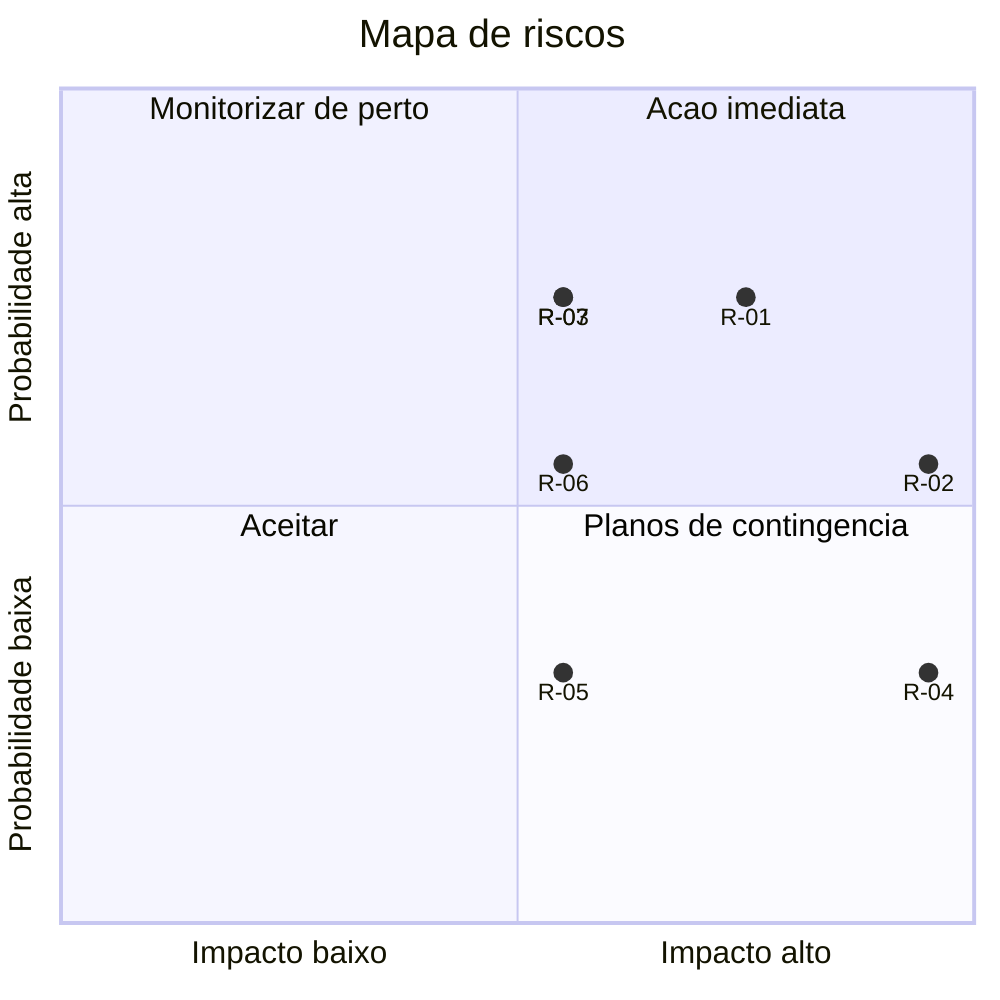

# Matriz de Riscos — {{PROJETO}}

**Responsável:** {{Nome}} · **Última revisão:** {{AAAA-MM-DD}} · **Próxima revisão:** {{data}}

---

## 1. Escalas

### Probabilidade
| Nível | Descrição | Indicação |
|---|---|---|
| 5 — Muito alta | Espera-se que aconteça | > 80% |
| 4 — Alta | Provável | 50–80% |
| 3 — Média | Pode acontecer | 20–50% |
| 2 — Baixa | Improvável | 5–20% |
| 1 — Muito baixa | Raro | < 5% |

### Impacto
| Nível | Prazo | Custo | Qualidade | Reputação |
|---|---|---|---|---|
| 5 — Crítico | > 2 meses | > {{X €}} | Inutilizável | Cobertura mediática negativa |
| 4 — Alto | 1–2 meses | {{...}} | Funcionalidade principal falha | Perda de clientes |
| 3 — Médio | 2–4 semanas | {{...}} | Degradação notória | Queixas |
| 2 — Baixo | 1 semana | {{...}} | Incómodo | Interna |
| 1 — Mínimo | < 1 semana | Desprezável | Cosmético | Nenhuma |

### Nível de risco (P × I)
| | I=1 | I=2 | I=3 | I=4 | I=5 |
|---|---|---|---|---|---|
| **P=5** | 5 | 10 | 15 | **20** | **25** |
| **P=4** | 4 | 8 | 12 | **16** | **20** |
| **P=3** | 3 | 6 | 9 | 12 | **15** |
| **P=2** | 2 | 4 | 6 | 8 | 10 |
| **P=1** | 1 | 2 | 3 | 4 | 5 |

| Faixa | Nível | Ação exigida |
|---|---|---|
| 15–25 | **Extremo** | Ação imediata; escalar ao sponsor; pode bloquear o projeto |
| 8–14 | **Alto** | Plano de mitigação com dono e prazo; acompanhamento semanal |
| 4–7 | **Médio** | Mitigar se o custo for razoável; acompanhamento mensal |
| 1–3 | **Baixo** | Aceitar e monitorizar |

---

## 2. Registo de riscos

| ID | Categoria | Risco | Causa | Consequência | P | I | Nível | Estratégia | Ação de mitigação | Dono | Prazo | Estado |
|---|---|---|---|---|---|---|---|---|---|---|---|---|
| R-01 | Técnico | {{Integração com ERP não suporta o volume}} | {{API limitada a 100 req/min}} | {{Encomendas atrasadas}} | 4 | 4 | **16 Alto** | Mitigar | {{Fila + processamento em lote; negociar aumento de quota}} | {{Nome}} | {{data}} | Em curso |
| R-02 | Recursos | {{Perda do único especialista em {{X}}}} | {{Concentração de conhecimento}} | {{Paragem de 4-6 semanas}} | 3 | 5 | **15 Extremo** | Mitigar | {{Programação em par; documentação; formar 2.ª pessoa}} | {{Nome}} | {{data}} | Em curso |
| R-03 | Âmbito | {{Requisitos continuam a mudar}} | {{Stakeholders não alinhados}} | {{Prazo derrapa}} | 4 | 3 | **12 Alto** | Mitigar | {{Congelamento de âmbito após {{data}}; processo formal de alterações}} | {{PO}} | {{data}} | Aberto |
| R-04 | Segurança | {{Fuga de dados entre tenants}} | {{Consulta sem filtro de tenant}} | {{Violação RGPD; coima}} | 2 | 5 | **10 Alto** | Mitigar | {{RLS obrigatória + teste automático de isolamento em todas as tabelas}} | {{Nome}} | {{data}} | Fechado |
| R-05 | Externo | {{Fornecedor cloud aumenta preços}} | — | {{Custo acima do orçamento}} | 2 | 3 | 6 Médio | Aceitar | {{Monitorizar; reavaliar anualmente}} | {{Nome}} | — | Monitorizado |
| R-06 | Legal | {{Alteração regulamentar exige mudanças}} | {{{{Regulamento X}} em consulta}} | {{Retrabalho}} | 3 | 3 | 9 Alto | Mitigar | {{Acompanhar; desenhar o módulo de forma configurável}} | {{Jurídico}} | {{data}} | Aberto |
| R-07 | Operacional | {{Equipa sem experiência de on-call}} | {{Primeiro sistema em produção 24/7}} | {{MTTR elevado}} | 4 | 3 | **12 Alto** | Mitigar | {{Runbooks + 2 exercícios simulados antes do GA}} | {{Nome}} | {{data}} | Em curso |

**Estratégias:** Evitar (eliminar a causa) · Mitigar (reduzir P ou I) · Transferir (seguro, contrato, terceiro) · Aceitar (registar e monitorizar)

---

## 3. Mapa de calor

---

## 4. Planos de contingência

> Para riscos de nível Extremo e Alto: o que fazer **se o risco se materializar**, apesar da mitigação.

### R-02 — Perda do especialista
| | |
|---|---|
| **Gatilho** | {{Comunicação de saída ou ausência prolongada}} |
| **Ação imediata** | {{Sessões de transferência de conhecimento gravadas nas 2 semanas de aviso}} |
| **Plano B** | {{Contratar consultor externo já identificado ({{empresa}}, ~{{X €}}/dia)}} |
| **Custo do plano B** | {{...}} |
| **Impacto residual** | {{Atraso de 2-3 semanas em vez de 6}} |

### R-01 — ERP não suporta o volume
| **Gatilho** | {{Fila acumula > 500 mensagens de forma sustentada}} |
| **Ação imediata** | {{Ativar modo degradado; processar em lotes noturnos}} |
| **Plano B** | {{Sincronização por ficheiro em vez de API}} |

---

## 5. Riscos fechados

| ID | Risco | Fechado em | Motivo |
|---|---|---|---|
| R-04 | {{Fuga entre tenants}} | {{data}} | {{RLS implementada e testada; risco residual Baixo}} |

---

## 6. Riscos materializados (tornaram-se problemas)

| ID | Risco | Data | Impacto real | Eficácia da mitigação | Lição |
|---|---|---|---|---|---|
| {{R-08}} | {{...}} | {{data}} | {{...}} | {{Parcial — reduziu de 6 para 3 semanas}} | {{...}} |

---

## 7. Cadência de revisão

| Nível | Frequência | Fórum |
|---|---|---|
| Extremo | Semanal | {{Reunião de projeto + sponsor}} |
| Alto | Quinzenal | {{Reunião de projeto}} |
| Médio | Mensal | {{Reunião de projeto}} |
| Baixo | Trimestral | {{Revisão de registo}} |

**Novos riscos podem ser levantados por qualquer pessoa, a qualquer momento**, em {{canal/processo}}.
