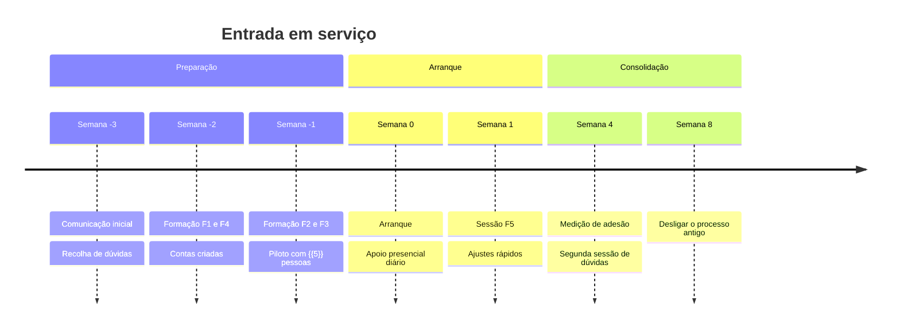

# Plano de Formação e Adesão — {{PROJETO}}

> **Data:** {{AAAA-MM-DD}} · **Dono:** {{nome}}

---

## 1. O problema que este plano resolve

Um sistema que ninguém usa falhou, por melhor que esteja construído. A adesão
não acontece por decreto e raramente por qualidade técnica: acontece quando
quem usa percebe o que ganha, sabe fazê-lo, e tem a quem perguntar.

**Objetivo:** {{X% dos utilizadores a usar em autonomia N semanas após o arranque}}.

---

## 2. Quem vai usar, e o que muda para cada um

| Grupo | Nº | O que faz hoje | O que passa a fazer | Ganha | Perde |
|---|---|---|---|---|---|
| {{Condutores}} | {{45}} | {{Papel entregue ao escritório}} | {{Regista no telemóvel}} | {{Não tem de passar no escritório}} | {{Tem de usar o telemóvel}} |
| {{Gestores}} | {{3}} | {{Folhas de cálculo}} | {{Aplicação}} | {{Relatórios automáticos}} | {{Perde o Excel que dominava}} |

> **A coluna "perde" é a mais importante do plano.** Toda a mudança tira alguma
> coisa a alguém. Nomear isso é o que permite responder-lhe; ignorá-lo é o que
> gera a resistência que depois se chama "falta de formação".

---

## 3. Resistências previstas

| Resistência | De quem | Resposta |
|---|---|---|
| {{"Isto é para nos controlarem"}} | {{Condutores}} | {{Dizer o que é medido e o que não é. Ser específico e verificável}} |
| {{"O papel funcionava"}} | {{...}} | {{Mostrar o que não funcionava — com números do próprio serviço}} |
| {{"Não tenho jeito para tecnologia"}} | {{...}} | {{Formação em pequenos grupos; padrinho na equipa}} |
| {{"Vou perder o meu papel"}} | {{Quem geria a folha de cálculo}} | {{Envolver como formador — de guardião a especialista}} |

---

## 4. Formação

| # | Sessão | Para quem | Duração | Formato | Quando |
|---|---|---|---|---|---|
| F1 | {{O que muda e porquê}} | {{Todos}} | {{30 min}} | {{Presencial, grupos de 15}} | {{−2 semanas}} |
| F2 | {{Usar no dia a dia}} | {{Condutores}} | {{45 min}} | {{Prática, com o próprio telemóvel}} | {{−1 semana}} |
| F3 | {{Gestão e relatórios}} | {{Gestores}} | {{2 h}} | {{Prática}} | {{−1 semana}} |
| F4 | {{Administração}} | {{Administradores}} | {{2 h}} | {{Prática}} | {{−2 semanas}} |
| F5 | {{Sessão de dúvidas}} | {{Todos}} | {{30 min}} | {{Aberta}} | {{+1 e +3 semanas}} |

**Regras que decidem se a formação resulta:**

| Regra | Porquê |
|---|---|
| **Com o aparelho de cada um, não com o do formador** | Uma demonstração vê-se; a aplicação aprende-se a usar |
| **Com dados que reconheçam** | As viaturas deles, não "Viatura Teste 1" |
| **Grupos pequenos** | Ninguém faz perguntas em frente a 40 pessoas |
| **A sessão F5 é a que mais vale** | As dúvidas reais só aparecem depois de usar |

---

## 5. Materiais

| Material | Formato | Para quem | Onde | Estado |
|---|---|---|---|---|
| {{Guia rápido de 1 página}} | {{A4, plastificado}} | {{Condutores}} | {{Na viatura}} | {{...}} |
| {{Manual completo}} | {{Digital}} | {{Todos}} | {{[Manual](02-manual-utilizador.md)}} | {{...}} |
| {{Vídeo de 3 minutos}} | {{...}} | {{Condutores}} | {{...}} | {{...}} |
| {{FAQ}} | {{Digital}} | {{Todos}} | {{[FAQ](05-faq-resolucao-problemas.md)}} | {{...}} |

> **O guia de uma página é o material mais usado e o menos investido.** Se só
> houver tempo para um, é esse.

---

## 6. Adesão faseada

**Piloto primeiro.** {{5}} pessoas escolhidas por serem representativas — não
por serem as mais entusiastas. Um piloto com voluntários entusiastas não prevê
nada sobre os restantes.

---

## 7. Apoio no arranque

| Período | Apoio | Quem | Onde |
|---|---|---|---|
| {{Semana 0}} | {{Presença no terreno}} | {{...}} | {{Junto de quem usa}} |
| {{Semanas 1–2}} | {{Contacto direto}} | {{...}} | {{...}} |
| {{A partir da 3}} | {{Suporte normal}} | {{...}} | {{...}} |

**Padrinhos:** {{1 por equipa}} — pessoas formadas mais cedo, que respondem às
dúvidas do lado. Perguntar ao colega é sempre mais fácil do que abrir um ticket.

---

## 8. Medir a adesão

| Indicador | Meta | Semana 1 | Semana 4 | Semana 8 |
|---|---|---|---|---|
| {} | | | |
| {} | | | |
| {{Nº de pedidos de suporte por semana}} | {{decrescente}} | | | |
| {{Satisfação (1–5)}} | {{≥ 4}} | | | |

**Sinal de alarme:** utilizadores que entraram uma vez e não voltaram. São o
grupo que a formação não alcançou, e não aparecem nas queixas — desistem em
silêncio. Vale a pena contactá-los um a um.

---

## 9. Desligar o processo antigo

| Condição | Verificada |
|---|---|
| {{≥ 90% dos registos já vêm da aplicação}} | ☐ |
| {{Sem defeitos de gravidade 1 ou 2 há 2 semanas}} | ☐ |
| {{Utilizadores formados, incluindo quem esteve ausente}} | ☐ |
| {{Dados históricos migrados e verificados}} | ☐ |

> Manter os dois em paralelo indefinidamente garante que ninguém adere ao novo.
> Desligar o antigo cedo demais garante que se volta a ele na primeira falha.
> A data tem de ser decidida, comunicada e cumprida.
